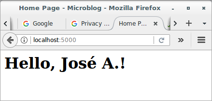
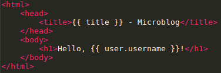
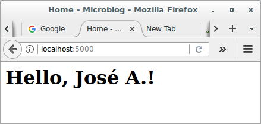
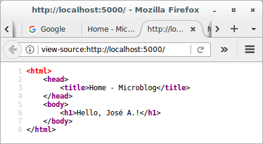
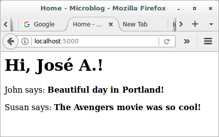

# Basic Development with Flask and Microblog

## Templates

By now, you should have a fully working, yet simple web application that 
has the following file structure:

```
microblog.git\
  venv\
  app\
    __init__.py
    routes.py
  microblog.py
```

To run the application, make sure `FLASK_APP=microblog.py` is set in 
your terminal session, and then execute `flask run`. This starts a web 
server with the application, which you can open by typing 
the **http://localhost:5000/** URL in your web browser's address bar.

In this section, you will continue working on the same application, and 
in particular, you are going to learn how to generate more elaborated 
web pages that have a complex structure and many dynamic components.

### Preparing yourself for working with templates

I want the home page of my microblogging application to have a heading 
that welcomes the user. For the moment, ignore that the application does 
not have the concept of users yet, as this is going to come later. For 
now, I'm going to use a *mock* user, which I'm going to implement as a 
Python dictionary, as follows:

```python
user = {'username': 'José A.'}
```

Creating mock objects is a useful technique that allows you to 
concentrate on one part of the application without having to worry about 
other parts of the system that don't exist yet. I want to design the 
home page of my application, and I don't want the fact that I don't have 
a user system in place to distract me, so I just make up a user object 
so that I can keep going.

The view function in the application returns a simple string. What I 
want to do now is expand that returned string into a complete HTML page, 
maybe something like this:

```python
# app/routes.py: Return complete HTML page from view function
from app import app


@app.route('/')
@app.route('/index')
def index():
    user = {'username': 'José A.'}
    return '''
<html>
    <head>
        <title>Home Page - Microblog</title>
    </head>
    <body>
        <h1>Hello, ''' + user['username'] + '''!</h1>
    </body>
</html>'''
```

Update the view function as shown above and give the application a try 
to see how it looks in your browser.



### What are templates?

I hope you agree with me that the solution used above to deliver HTML to 
the browser is not good. Consider how complex the code in this view 
function will become when I have the blog posts from users, which are 
going to constantly change. The application is also going to have more 
view functions that are going to be associated with other URLs, so 
imagine if one day I decide to change the layout of this application, 
and have to update the HTML in every view function. This is clearly not 
an option that will scale as the application grows.

If you could keep the logic of your application separate from the layout 
or presentation of your web pages, then things would be much better 
organized, don't you think? You could even hire a web designer to create 
a killer web site while you code the application logic in Python.

Templates help achieve this separation between presentation and business 
logic. In Flask, templates are written as separate files, stored in 
a *templates* folder that is inside the application package. So, after 
making sure that you are in the *microblog* directory, create the 
directory where templates will be stored:

```
$ cd microblog.git/
$ mkdir app/templates
```

Below you can see your first template, which is similar in functionality 
to the HTML page returned by the `index()` view function above. Write 
this file in **app/templates/index.html**, which would be the main page 
template:

```html
<html>
    <head>
        <title>{{ title }} - Microblog</title>
    </head>
    <body>
        <h1>Hello, {{ user.username }}!</h1>
    </body>
</html>
```

This is a mostly standard, very simply HTML page. The only interesting 
thing in this page is that there are a couple of placeholders for the 
dynamic content, enclosed in `{{ ... }}` sections. These placeholders 
represent the parts of the page that are variable and will only be known 
at runtime.

Now that the presentation of the page was offloaded to the HTML 
template, the view function can be simplified:

```python
# app/routes.py: Use render_template() function
from flask import render_template
from app import app


@app.route('/')
@app.route('/index')
def index():
    user = {'username': 'José A.'}
    return render_template('index.html', 
                           title = 'Home', 
                           user = user)
```

This looks much better, right? Try this new version of the application 
to see how the template works. Once you have the page loaded in your 
browser, you may want to view the source HTML and compare it against the 
original template.







The operation that converts a template into a complete HTML page is 
called **rendering**. To render the template, I had to import a function 
that comes with the Flask framework called `render_template()`. This 
function takes a template filename and a variable list of template 
arguments and returns the same template, but with all the placeholders 
in it replaced with actual values.

Under the covers, the `render_template()` function invokes 
the [Jinja2](http://jinja.pocoo.org) templating engine that comes 
bundled with the Flask framework. Jinja2 substitutes `{{ ... }}` blocks 
with the corresponding values, given by the arguments provided in 
the `render_template()` call.

### Conditional statements

You have seen how Jinja2 replaces placeholders with actual values during 
rendering, but this is just one of many powerful operations Jinja2 
supports in template files. For example, templates also support control 
statements, given inside `` blocks. The next version of 
the **index.html** template adds a conditional statement:

```html
<html>
    <head>
        
        <title>{{ title }} - Microblog</title>
        
        <title>Welcome to Microblog!</title>
        
    </head>
    <body>
        <h1>Hello, {{ user.username }}!</h1>
    </body>
</html>
```

Now the template is a bit smarter. If the view function forgets to pass 
a value for the `title` placeholder variable, then instead of showing an 
empty title the template will provide a default one. You can try how 
this conditional works by removing the `title` argument in 
the `render_template()` call of the view function.

### Loops

The logged in user will probably want to see recent posts from connected 
users in the home page, so what I'm going to do now is extend the 
application to support that.

Once again, I'm going to rely on the handy fake object trick to create 
some users and some posts to show:

```python
# app/routes.py: Fake posts in view function
from flask import render_template
from app import app


@app.route('/')
@app.route('/index')
def index():
    user = {'username': 'José A.'}
    posts = [
        {
            'author': {'username': 'John'},
            'body': 'Beautiful day in Portland!'
        },
        {
            'author': {'username': 'Susan'},
            'body': 'The Avengers movie was so cool!'
        }
    ]
    return render_template('index.html', 
                           title = 'Home', 
                           user = user, 
                           posts = posts)
```

To represent user posts I'm using a list, where each element is a 
dictionary that has `author` and `body` fields. When I get to implement 
users and blog posts for real I'm going to try to preserve these field 
names as much as possible, so that all the work I'm doing to design and 
test the home page template using these fake objects will continue to be 
valid when I introduce real users and posts.

On the template side I have to solve a new problem. The list of posts 
can have any number of elements, it is up to the view function to decide 
how many posts are going to be presented in the page. The template 
cannot make any assumptions about how many posts there are, so it needs 
to be prepared to render as many posts as the view sends in a generic 
way.

For this type of problem, Jinja2 offers a `for` control structure:

```html
<html>
    <head>
        
        <title>{{ title }} - Microblog</title>
        
        <title>Welcome to Microblog!</title>
        
    </head>
    <body>
        <h1>Hi, {{ user.username }}!</h1>
        
        <div>
            <p>{{ post.author.username }} says: <b>{{ post.body }}</b></p>
        </div>
        
    </body>
</html>
```

Simple, right? Give this new version of the application a try, and be 
sure to play with adding more content to the posts list to see how the 
template adapts and always renders all the posts the view function 
sends.


