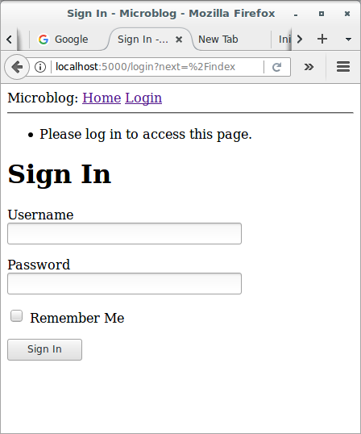
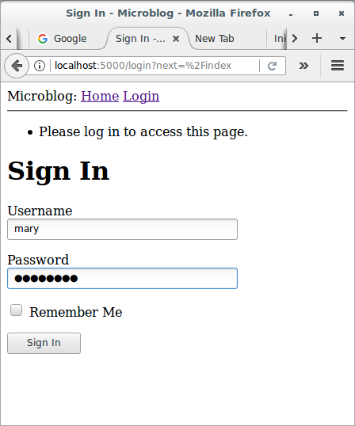
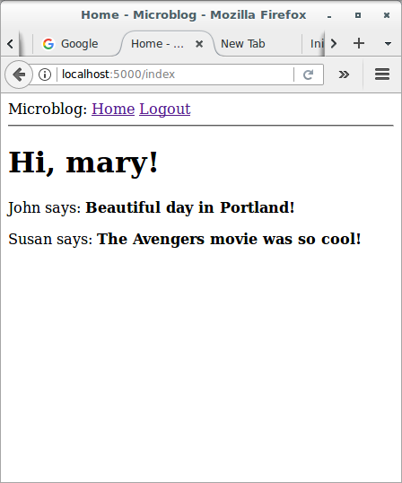

# Basic Development with Flask and Microblog

## User Logins

### Introduction

Previously, you learned how to create the user login form and how to 
work with a database. This part will teach you how to combine the 
topics from those two sections to create a simple user login system.

### Password Hashing

If you remember, previously, the user model was given a `password_hash` 
field, that so far is unused. The purpose of this field is to hold a 
hash of the user password, which will be used to verify the password 
entered by the user during the log in process. Password hashing is a 
complicated topic that should be left to security experts, but there are 
several easy to use libraries that implement all that logic in a way 
that is simple to be invoked from an application.

One of the packages that implement password hashing 
is [Werkzeug](http://werkzeug.pocoo.org/), which you may have seen 
referenced in the output of pip when you install Flask, since it is one 
of its core dependencies. Since it is a dependency, Werkzeug is already 
installed in your virtual environment. The following Python shell 
session demonstrates how to hash a password:

```python
>>> from werkzeug.security import generate_password_hash
>>> hash = generate_password_hash('foobar')
>>> hash
'pbkdf2:sha256:50000$33kYRkx2$953df8b0be8693f8eb608547d23a57c9e7195d0689b0d179881d59c3d1a7a7a6'
```

In this example, the password `foobar` is transformed into a long 
encoded string through a series of cryptographic operations that have no 
known reverse operation, which means that a person that obtains the 
hashed password will be unable to use it to obtain the original 
password. As an additional measure, if you hash the same password 
multiple times, you will get different results, so this makes it 
impossible to identify if two users have the same password by looking at 
their hashes.

The verification process is done with a second function from Werkzeug, 
as follows:

```python
>>> from werkzeug.security import check_password_hash
>>> check_password_hash(hash, 'foobar')
True
>>> check_password_hash(hash, 'barfoo')
False
```

The verification function takes a password hash that was previously 
generated, and a password entered by the user at the time of log in. The 
function returns `True` if the password provided by the user matches the 
hash, or `False` otherwise.

The whole password hashing logic can be implemented as two new methods 
in the user model:

```python
# app/models.py: Password hashing and verification
from datetime import datetime
from app import db
from werkzeug.security import generate_password_hash, check_password_hash

class User(db.Model):
    id = db.Column(db.Integer, primary_key=True)
    username = db.Column(db.String(64), index=True, unique=True)
    email = db.Column(db.String(120), index=True, unique=True)
    password_hash = db.Column(db.String(128))
    posts = db.relationship('Post', backref='author', lazy='dynamic')

    def __repr__(self):
        return f'<User {self.username}>'

    def set_password(self, password):
        self.password_hash = generate_password_hash(password)

    def check_password(self, password):
        return check_password_hash(self.password_hash, password)

class Post(db.Model):
    id = db.Column(db.Integer, primary_key=True)
    body = db.Column(db.String(140))
    timestamp = db.Column(db.DateTime, 
                          index = True, 
                          default = datetime.utcnow)
    user_id = db.Column(db.Integer, db.ForeignKey('user.id'))

    def __repr__(self):
        return f'<Post {self.body}>'
```

With these two methods in place, a user object is now able to do secure 
password verification, without the need to ever store original 
passwords. Here is an example usage of these new methods 
(use `flask shell`):

```
>>> u = User(username='mary', email='mary@mail.com')
>>> u.set_password('mypassword')
>>> u.check_password('anotherpassword')
False
>>> u.check_password('mypassword')
True
```

### Introduction to Flask-Login

Now, I'm going to introduce you to a very popular Flask extension 
called [Flask-Login](https://flask-login.readthedocs.io/en/latest/). 
This extension manages the user logged-in state, so that for example 
users can log in to the application and then navigate to different pages 
while the application "remembers" that the user is logged in. It also 
provides the "remember me" functionality that allows users to remain 
logged in even after closing the browser window. To be ready for this 
section, you can start by installing Flask-Login in your virtual 
environment:

```
(venv) $ pip install flask-login
```

As with other extensions, Flask-Login needs to be created and 
initialized right after the application instance in *app/__init__.py*. 
Let's see how this extension is initialized:

```python
# app/__init__.py: Flask-Login initialization
from flask import Flask
from config import Config
from flask_sqlalchemy import SQLAlchemy
from flask_migrate import Migrate
from flask_login import LoginManager

app = Flask(__name__)
app.config.from_object(Config)
db = SQLAlchemy(app)
migrate = Migrate(app, db)
login_manager = LoginManager(app)

from app import routes, models
```

### Preparing The User Model for Flask-Login

The Flask-Login extension works with the application's user model, and 
expects certain properties and methods to be implemented in it. This 
approach is nice, because as long as these required items are added to 
the model, Flask-Login does not have any other requirements, so for 
example, it can work with user models that are based on any database 
system.

The four required items are listed below:

* `is_authenticated`: a property that is `True` if the user has valid 
credentials or `False` otherwise.
* `is_active`: a property that is `True` if the user's account is active 
or `False` otherwise.
* `is_anonymous`: a property that is `False` for regular users, 
and `True` for a special, anonymous user.
* `get_id()`: a method that returns a unique identifier for the user as 
a string (unicode, if using Python 2).

I can implement these four easily, but since the implementations are 
fairly generic, Flask-Login provides a *mixin* class called `UserMixin` 
that includes generic implementations that are appropriate for most user 
model classes. Here is how the mixin class is added to the model:

```python
# app/models.py: Flask-Login user mixin class
from datetime import datetime
from app import db
from werkzeug.security import generate_password_hash, check_password_hash
from flask_login import UserMixin

class User(UserMixin, db.Model):
    id = db.Column(db.Integer, primary_key=True)
    username = db.Column(db.String(64), index=True, unique=True)
    email = db.Column(db.String(120), index=True, unique=True)
    password_hash = db.Column(db.String(128))
    posts = db.relationship('Post', backref='author', lazy='dynamic')

    def __repr__(self):
        return f'<User {self.username}>'

    def set_password(self, password):
        self.password_hash = generate_password_hash(password)

    def check_password(self, password):
        return check_password_hash(self.password_hash, password)

class Post(db.Model):
    id = db.Column(db.Integer, primary_key=True)
    body = db.Column(db.String(140))
    timestamp = db.Column(db.DateTime, 
                          index = True, 
                          default = datetime.utcnow)
    user_id = db.Column(db.Integer, db.ForeignKey('user.id'))

    def __repr__(self):
        return f'<Post {self.body}>'
```

### User Loader Function

Flask-Login keeps track of the logged in user by storing its unique 
identifier in Flask's *user session*, a storage space assigned to each 
user who connects to the application. Each time the logged-in user 
navigates to a new page, Flask-Login retrieves the ID of the user from 
the session, and then loads that user into memory.

Because Flask-Login knows nothing about databases, it needs the 
application's help in loading a user. For that reason, the extension 
expects that the application will configure a user loader function, that 
can be called to load a user given the ID. This function can be added in 
the *app/models.py* module:

```python
# app/models.py: Flask-Login user loader function
from datetime import datetime
from app import db, login_manager
from werkzeug.security import generate_password_hash, check_password_hash
from flask_login import UserMixin

class User(UserMixin, db.Model):
    id = db.Column(db.Integer, primary_key=True)
    username = db.Column(db.String(64), index=True, unique=True)
    email = db.Column(db.String(120), index=True, unique=True)
    password_hash = db.Column(db.String(128))
    posts = db.relationship('Post', backref='author', lazy='dynamic')

    def __repr__(self):
        return f'<User {self.username}>'

    def set_password(self, password):
        self.password_hash = generate_password_hash(password)

    def check_password(self, password):
        return check_password_hash(self.password_hash, password)

class Post(db.Model):
    id = db.Column(db.Integer, primary_key=True)
    body = db.Column(db.String(140))
    timestamp = db.Column(db.DateTime, 
                          index = True, 
                          default = datetime.utcnow)
    user_id = db.Column(db.Integer, db.ForeignKey('user.id'))

    def __repr__(self):
        return f'<Post {self.body}>'

@login_manager.user_loader
def load_user(id):
    return User.query.get(int(id))
```

The user loader is registered with Flask-Login with 
the `@login_manager.user_loader` decorator. The `id` that Flask-Login 
passes to the function as an argument is going to be a string, so 
databases that use numeric IDs need to convert the string to integer as 
you see above.

### Logging Users In

Let's revisit the login view function, which as you recall, implemented 
a fake login that just issued a `flash()` message. Now that the 
application has access to a user database and knows how to generate and 
verify password hashes, this view function can be completed. Let's see:

```python
# app/routes.py: Login view function logic
from flask import render_template, flash, redirect, url_for
from app import app
from app.forms import LoginForm
from flask_login import current_user, login_user
from app.models import User


@app.route('/')
@app.route('/index')
def index():
    user = {'username': 'José A.'}
    posts = [
        {
            'author': {'username': 'John'},
            'body': 'Beautiful day in Portland!'
        },
        {
            'author': {'username': 'Susan'},
            'body': 'The Avengers movie was so cool!'
        }
    ]
    return render_template('index.html', 
                           title = 'Home', 
                           user = user, 
                           posts = posts)

@app.route('/login', methods=['GET', 'POST'])
def login():
    if current_user.is_authenticated:
        return redirect(url_for('index'))
    form = LoginForm()
    if form.validate_on_submit():
        user = User.query.filter_by(username=form.username.data).first()
        if user is None or not user.check_password(form.password.data):
            flash('Invalid username or password')
            return redirect(url_for('login'))
        login_user(user, remember=form.remember_me.data)
        return redirect(url_for('index'))
    return render_template('login.html', title='Sign In', form=form)
```

The top two lines in the `login()` function deal with a weird situation. 
Imagine you have a user that is logged in, and the user navigates to 
the */login* URL of your application. Clearly, that is a mistake, so I 
want to not allow that. The `current_user` variable comes from 
Flask-Login and can be used at any time during the handling to obtain 
the user object that represents the client of the request. The value of 
this variable can be a user object from the database (which Flask-Login 
reads through the user loader callback I provided above), or a special 
anonymous user object if the user did not log in yet. Remember those 
properties that Flask-Login required in the user object? One of those 
was `is_authenticated`, which comes in handy to check if the user is 
logged in or not. When the user is already logged in, I just redirect to 
the index page.

In place of the `flash()` call that I used earlier, now I can log the 
user in for real. The first step is to load the user from the database. 
The username came with the form submission, so I can query the database 
with that to find the user. For this purpose, I'm using 
the `filter_by()` method of the SQLAlchemy query object. The result 
of `filter_by()` is a query that only includes the objects that have a 
matching username. Since I know there is only going to be one or zero 
results, I complete the query by calling `first()`, which will return 
the user object if it exists, or `None` if it does not. Previously, you 
have seen that when you call the `all()` method in a query, the query 
executes and you get a list of all the results that match that query. 
The `first()` method is another commonly used way to execute a query, 
when you only need to have one result.

If I got a match for the username that was provided, I can next check if 
the password that also came with the form is valid. This is done by 
invoking the `check_password()` method I defined above. This will take 
the password hash stored with the user and determine if the password 
entered in the form matches the hash or not. So now I have two possible 
error conditions: the username can be invalid, or the password can be 
incorrect for the user. In either of those cases, I flash a message, and 
redirect back to the login prompt so that the user can try again.

If the username and password are both correct, then I call 
the `login_user()` function, which comes from Flask-Login. This function 
will register the user as logged in, so that means that any future pages 
the user navigates to will have the `current_user` variable set to that 
user.

To complete the login process, I just redirect the newly logged-in user 
to the index page.

### Logging Users Out

I know I will also need to offer users the option to log out of the 
application. This can be done with Flask-Login's `logout_user()` 
function. Let's see the logout view function in *app/routes.py*:

```python
# app/routes.py: Logout view function
from flask import render_template, flash, redirect, url_for
from app import app
from app.forms import LoginForm
from flask_login import current_user, login_user, logout_user
from app.models import User


@app.route('/')
@app.route('/index')
def index():
    user = {'username': 'José A.'}
    posts = [
        {
            'author': {'username': 'John'},
            'body': 'Beautiful day in Portland!'
        },
        {
            'author': {'username': 'Susan'},
            'body': 'The Avengers movie was so cool!'
        }
    ]
    return render_template('index.html', 
                           title = 'Home', 
                           user = user, 
                           posts = posts)

@app.route('/login', methods=['GET', 'POST'])
def login():
    if current_user.is_authenticated:
        return redirect(url_for('index'))
    form = LoginForm()
    if form.validate_on_submit():
        user = User.query.filter_by(username=form.username.data).first()
        if user is None or not user.check_password(form.password.data):
            flash('Invalid username or password')
            return redirect(url_for('login'))
        login_user(user, remember=form.remember_me.data)
        return redirect(url_for('index'))
    return render_template('login.html', title='Sign In', form=form)

@app.route('/logout')
def logout():
    logout_user()
    return redirect(url_for('index'))
```

To expose this link to users, I can make the Login link in the 
navigation bar automatically switch to a Logout link after the user logs 
in. This can be done with a conditional in the *base.html* template:

```html
<html>
    <head>
        
        <title>{{ title }} - Microblog</title>
        
        <title>Welcome to Microblog!</title>
        
    </head>
    <body>
        <div>
            Microblog: 
            <a href="{{ url_for('index') }}">Home</a>
            
            <a href="{{ url_for('login') }}">Login</a>
            
            <a href="{{ url_for('logout') }}">Logout</a>
            
        </div>
        <hr>
        
        
        <ul>
            
            <li>{{ message }}</li>
            
        </ul>
        
        
        
    </body>
</html>
```

The `is_anonymous` property is one of the attributes that Flask-Login 
adds to user objects through the `UserMixin` class. 
The `current_user.is_anonymous` expression is going to be `True` only 
when the user is not logged in.

### Requiring Users To Login

Flask-Login provides a very useful feature that forces users to log in 
before they can view certain pages of the application. If a user who is 
not logged in tries to view a protected page, Flask-Login will 
automatically redirect the user to the login form, and only redirect 
back to the page the user wanted to view after the login process is 
complete.

For this feature to be implemented, Flask-Login needs to know what is 
the view function that handles logins. This can be added 
in *app/__init__.py*:

```python
# app/__init__.py: Flask-Login view function that handles logins
from flask import Flask
from config import Config
from flask_sqlalchemy import SQLAlchemy
from flask_migrate import Migrate
from flask_login import LoginManager

app = Flask(__name__)
app.config.from_object(Config)
db = SQLAlchemy(app)
migrate = Migrate(app, db)
login_manager = LoginManager(app)
login_manager.login_view = 'login'

from app import routes, models
```

The `'login'` value above is the function (or endpoint) name for the 
login view. In other words, the name you would use in a `url_for()` call 
to get the URL.

The way Flask-Login protects a view function against anonymous users is 
with a decorator called `@login_required`. When you add this decorator 
to a view function below the `@app.route` decorators from Flask, the 
function becomes protected and will not allow access to users that are 
not authenticated. Here is how the decorator can be applied to the index 
view function of the application:

```python
# app/routes.py: @login_required decorator
from flask import render_template, flash, redirect, url_for
from app import app
from app.forms import LoginForm
from flask_login import current_user, login_user, logout_user, login_required
from app.models import User


@app.route('/')
@app.route('/index')
@login_required
def index():
    user = {'username': 'José A.'}
    posts = [
        {
            'author': {'username': 'John'},
            'body': 'Beautiful day in Portland!'
        },
        {
            'author': {'username': 'Susan'},
            'body': 'The Avengers movie was so cool!'
        }
    ]
    return render_template('index.html', 
                           title = 'Home', 
                           user = user, 
                           posts = posts)

@app.route('/login', methods=['GET', 'POST'])
def login():
    if current_user.is_authenticated:
        return redirect(url_for('index'))
    form = LoginForm()
    if form.validate_on_submit():
        user = User.query.filter_by(username=form.username.data).first()
        if user is None or not user.check_password(form.password.data):
            flash('Invalid username or password')
            return redirect(url_for('login'))
        login_user(user, remember=form.remember_me.data)
        return redirect(url_for('index'))
    return render_template('login.html', title='Sign In', form=form)

@app.route('/logout')
def logout():
    logout_user()
    return redirect(url_for('index'))
```

### Redirecting Back From The Successful Login

What remains is to implement the redirect back from the successful login 
to the page the user wanted to access. When a user that is not logged in 
accesses a view function protected with the `@login_required` decorator, 
the decorator is going to redirect to the login page, but it is going to 
include some extra information in this redirect so that the application 
can then return to the first page. If the user navigates to */index*, 
for example, the `@login_required` decorator will intercept the request 
and respond with a redirect to */login*, but it will add a query string 
argument to this URL, making the complete redirect 
URL */login?next=/index*. The `next` query string argument is set to the 
original URL, so the application can use that to redirect back after 
login.

Here is shown how to read and process the `next` query string argument:

```python
# app/routes.py: Redirect to "next" page
from flask import render_template, flash, redirect, url_for, request
from app import app
from app.forms import LoginForm
from flask_login import current_user, login_user, logout_user, login_required
from app.models import User
from werkzeug.urls import url_parse


@app.route('/')
@app.route('/index')
@login_required
def index():
    user = {'username': 'José A.'}
    posts = [
        {
            'author': {'username': 'John'},
            'body': 'Beautiful day in Portland!'
        },
        {
            'author': {'username': 'Susan'},
            'body': 'The Avengers movie was so cool!'
        }
    ]
    return render_template('index.html', 
                           title = 'Home', 
                           user = user, 
                           posts = posts)

@app.route('/login', methods=['GET', 'POST'])
def login():
    if current_user.is_authenticated:
        return redirect(url_for('index'))
    form = LoginForm()
    if form.validate_on_submit():
        user = User.query.filter_by(username=form.username.data).first()
        if user is None or not user.check_password(form.password.data):
            flash('Invalid username or password')
            return redirect(url_for('login'))
        login_user(user, remember=form.remember_me.data)
        next_page = request.args.get('next')
        if not next_page or url_parse(next_page).netloc != '':
            next_page = url_for('index')
        return redirect(next_page)
    return render_template('login.html', title='Sign In', form=form)

@app.route('/logout')
def logout():
    logout_user()
    return redirect(url_for('index'))
```

Right after the user is logged in by calling 
Flask-Login's `login_user()` function, the value of the `next` query 
string argument is obtained. Flask provides a `request` variable that 
contains all the information that the client sent with the request. In 
particular, the `request.args` attribute exposes the contents of the 
query string in a friendly dictionary format. There are actually three 
possible cases that need to be considered to determine where to redirect 
after a successful login:

* If the login URL does not have a `next` argument, then the user is 
redirected to the index page.
* If the login URL includes a `next` argument that is set to a relative 
path (or in other words, a URL without the domain portion), then the 
user is redirected to that URL.
* If the login URL includes a `next` argument that is set to a full URL 
that includes a domain name, then the user is redirected to the index 
page.

The first and second cases are self-explanatory. The third case is in 
place to make the application more secure. An attacker could insert a 
URL to a malicious site in the `next` argument, so the application only 
redirects when the URL is relative, which ensures that the redirect 
stays within the same site as the application. To determine if the URL 
is relative or absolute, I parse it with Werkzeug's `url_parse()` 
function and then check if the `netloc` component is set or not.

### Showing The Logged In User in Templates

Do you recall way back when I created a fake user to help me design the 
home page of the application before the user subsystem was in place? 
Well, the application has real users now, so I can now remove the fake 
user and start working with real users. Instead of the fake user I can 
use Flask-Login's `current_user` in file *app/templates/index.html*:

```html



    <h1>Hi, {{ current_user.username }}!</h1>
    
    <div>
        <p>{{ post.author.username }} says: <b>{{ post.body }}</b></p>
    </div>
    

```

And I can remove the `user` template argument in the view function:

```python
# app/routes.py: Do not pass user to template anymore
from flask import render_template, flash, redirect, url_for, request
from app import app
from app.forms import LoginForm
from flask_login import current_user, login_user, logout_user, login_required
from app.models import User
from werkzeug.urls import url_parse


@app.route('/')
@app.route('/index')
@login_required
def index():
    posts = [
        {
            'author': {'username': 'John'},
            'body': 'Beautiful day in Portland!'
        },
        {
            'author': {'username': 'Susan'},
            'body': 'The Avengers movie was so cool!'
        }
    ]
    return render_template('index.html', 
                           title = 'Home', 
                           posts = posts)

@app.route('/login', methods=['GET', 'POST'])
def login():
    if current_user.is_authenticated:
        return redirect(url_for('index'))
    form = LoginForm()
    if form.validate_on_submit():
        user = User.query.filter_by(username=form.username.data).first()
        if user is None or not user.check_password(form.password.data):
            flash('Invalid username or password')
            return redirect(url_for('login'))
        login_user(user, remember=form.remember_me.data)
        next_page = request.args.get('next')
        if not next_page or url_parse(next_page).netloc != '':
            next_page = url_for('index')
        return redirect(next_page)
    return render_template('login.html', title='Sign In', form=form)

@app.route('/logout')
def logout():
    logout_user()
    return redirect(url_for('index'))
```

This is a good time to test how the login and logout functionality 
works. Since there is still no user registration, the only way to add a 
user to the database is to do it via the Python shell, so 
run `flask shell` and enter the following commands to register a user:

```python
>>> u = User(username='mary', email='mary@mail.com')
>>> u.set_password('sunshine')
>>> db.session.add(u)
>>> db.session.commit()
```

If you start the application and try to access *http://localhost:5000/* 
or *http://localhost:5000/index*, you will be immediately redirected to 
the login page, and after you log in using the credentials of the user 
that you added to your database, you will be returned to the original 
page, in which you will see a personalized greeting.






