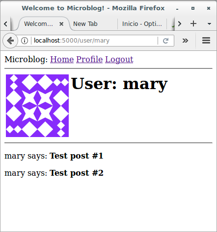
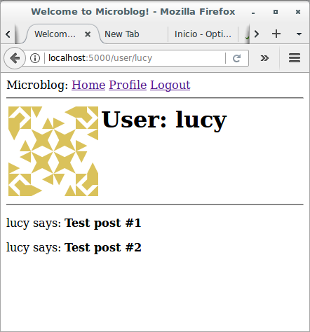
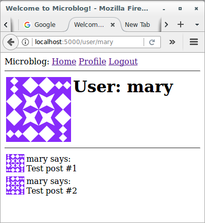
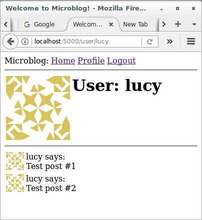
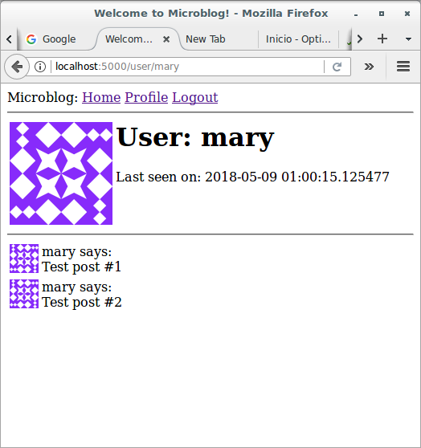
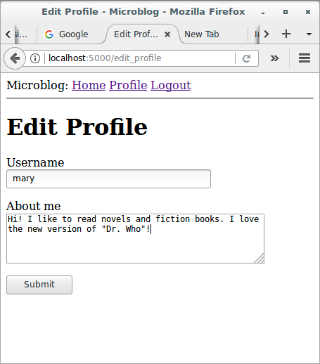
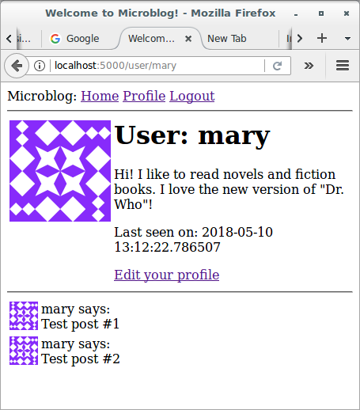

# Basic Development with Flask and Microblog

## Profile Page and Avatars

### Introduction

This section is going to be dedicated to adding user profile pages to 
the application. A user profile page is a page in which information 
about a user is presented, often with information entered by the users 
themselves. I will show you how to generate profile pages for all users 
dynamically, and then I'll add a small profile editor that users can use 
to enter their information.

### User Profile Page

To create a user profile page, let's first write a new view function 
that maps to the */user/<username>* URL:

```python
# app/routes.py: User profile view function
from flask import render_template, flash, redirect, url_for, request
from app import app, db
from app.forms import LoginForm, RegistrationForm
from flask_login import current_user, login_user, logout_user, login_required
from app.models import User
from werkzeug.urls import url_parse


@app.route('/')
@app.route('/index')
@login_required
def index():
    posts = [
        {
            'author': {'username': 'John'},
            'body': 'Beautiful day in Portland!'
        },
        {
            'author': {'username': 'Susan'},
            'body': 'The Avengers movie was so cool!'
        }
    ]
    return render_template('index.html', 
                           title = 'Home', 
                           posts = posts)

@app.route('/login', methods=['GET', 'POST'])
def login():
    if current_user.is_authenticated:
        return redirect(url_for('index'))
    form = LoginForm()
    if form.validate_on_submit():
        user = User.query.filter_by(username=form.username.data).first()
        if user is None or not user.check_password(form.password.data):
            flash('Invalid username or password')
            return redirect(url_for('login'))
        login_user(user, remember=form.remember_me.data)
        next_page = request.args.get('next')
        if not next_page or url_parse(next_page).netloc != '':
            next_page = url_for('index')
        return redirect(next_page)
    return render_template('login.html', title='Sign In', form=form)

@app.route('/logout')
def logout():
    logout_user()
    return redirect(url_for('index'))

@app.route('/register', methods=['GET', 'POST'])
def register():
    if current_user.is_authenticated:
        return redirect(url_for('index'))
    form = RegistrationForm()
    if form.validate_on_submit():
        user = User(username=form.username.data, email=form.email.data)
        user.set_password(form.password.data)
        db.session.add(user)
        db.session.commit()
        flash('Congratulations, you are now a registered user!')
        return redirect(url_for('login'))
    return render_template('register.html', title='Register', form=form)

@app.route('/user/<username>')
@login_required
def user(username):
    user = User.query.filter_by(username=username).first_or_404()
    posts = [
        {'author': user, 'body': 'Test post #1'}, 
        {'author': user, 'body': 'Test post #2'}
    ]
    return render_template('user.html', user=user, posts=posts)
```

The `@app.route` decorator that I used to declare this view function 
looks a little bit different than the previous ones. In this case I have 
a dynamic component in it, which is indicated as the `<username>` URL 
component that is surrounded by `<` and `>`. When a route has a dynamic 
component, Flask will accept any text in that portion of the URL, and 
will invoke the view function with the actual text as an argument. For 
example, if the client browser requests URL `/user/mary`, the view 
function is going to be called with the argument `username` set 
to `'susan'`. This view function is only going to be accessible to 
logged in users, so I have added the `@login_required` decorator from 
Flask-Login.

The implementation of this view function is fairly simple. I first try 
to load the user from the database using a query by the username. You 
have seen before that a database query can be executed by 
calling `all()` if you want to get all results, or `first()` if you want 
to get just the first result or `None` if there are zero results. In 
this view function I'm using a variant of `first()` 
called `first_or_404()`, which works exactly like `first()` when there 
are results, but in the case that there are no results automatically 
sends a [404 error](https://en.wikipedia.org/wiki/HTTP_404) back to the 
client. Executing the query in this way I save myself from checking if 
the query returned a user, because when the username does not exist in 
the database the function will not return and instead a 404 exception 
will be raised.

If the database query does not trigger a 404 error, then that means that 
a user with the given username was found. Next, I initialize a fake list 
of posts for this user, finally render a new *user.html* template to 
which I pass the user object and the list of posts.

The *user.html* template is shown below:

```html



    <h1>User: {{ user.username }}</h1>
    <hr>
    
    <p>
    {{ post.author.username }} says: <b>{{ post.body }}</b>
    </p>
    

```

The profile page is now complete, but a link to it does not exist 
anywhere in the web site. To make it a bit more easy for users to check 
their own profile, I'm going to add a link to it in the navigation bar 
at the top:

```html
<html>
    <head>
        
        <title>{{ title }} - Microblog</title>
        
        <title>Welcome to Microblog!</title>
        
    </head>
    <body>
        <div>
            Microblog: 
            <a href="{{ url_for('index') }}">Home</a>
            
            <a href="{{ url_for('login') }}">Login</a>
            
            <a href="{{ url_for('user', username=current_user.username) }}">Profile</a>
            <a href="{{ url_for('logout') }}">Logout</a>
            
        </div>
        <hr>
        
        
        <ul>
            
            <li>{{ message }}</li>
            
        </ul>
        
        
        
    </body>
</html>
```

The only interesting change here is the `url_for()` call that is used to 
generate the link to the profile page. Since the user profile view 
function takes a dynamic argument, the `url_for()` function receives a 
value for it as a keyword argument. Since this is a link that points to 
the logged in's user profile, I can use Flask-Login's `current_user` to 
generate the correct URL.


Give the application a try now. Clicking on the `Profile` link at the 
top should take you to your own user page. At this point there are no 
links that will take to the profile page of other users, but if you want 
to access those pages you can type the URL by hand in the browser's 
address bar. For example, if you have a user named "lucy" registered on 
your application, you can view the corresponding user profile by 
typing *http://localhost:5000/user/lucy* in the address bar.


### Avatars

I'm sure you agree that the profile pages that I just built are pretty 
boring. To make them a bit more interesting, I'm going to add user 
avatars, but instead of having to deal with a possibly large collection 
of uploaded images in the server, I'm going to use 
the [Gravatar](https://en.gravatar.com/) service to provide images for 
all users.

The Gravatar service is very simple to use. To request an image for a 
given user, a URL with the 
format *https://www.gravatar.com/avatar/<hash>*, where `<hash>` is the 
MD5 hash of the user's email address. Below you can see how to obtain 
the Gravatar URL for a user with email `mary@mail.com`:

```python
>>> from hashlib import md5
>>> 'https://www.gravatar.com/avatar/' + md5(b'mary@mail.com').hexdigest()
'https://www.gravatar.com/avatar/f393bea66bb04194c81b875b2f308159'
```

If you want to see an actual example, my own Gravatar URL 
is *https://www.gravatar.com/avatar/51f5b72a36f48609b3048b6a5f2de2bc*. 
Here is what Gravatar returns for this URL:


By default the image size returned is 80x80 pixels, but a different size 
can be requested by adding a `s` argument to the URL's query string. For 
example, to obtain my own avatar as a 128x128 pixel image, the URL 
is *https://www.gravatar.com/avatar/51f5b72a36f48609b3048b6a5f2de2bc?s=128*. 
Here is what Gravatar returns for this URL:


Another interesting argument that can be passed to Gravatar as a query 
string argument is `d`, which determines what image Gravatar provides 
for users that do not have an avatar registered with the service. My 
favorite is called "identicon", which returns a nice geometric design 
that is different for every email. For example:


Note that some web browser extensions such as Ghostery block Gravatar 
images, as they consider that Automattic (the owners of the Gravatar 
service) can determine what sites you visit based on the requests they 
get for your avatar. If you don't see avatars in your browser, consider 
that the problem may be due to an extension that you have installed in 
your browser.

Since avatars are associated with users, it makes sense to add the logic 
that generates the avatar URLs to the user model. Let's see:

```python
# app/models.py: User avatar URLs
from datetime import datetime
from app import db, login_manager
from werkzeug.security import generate_password_hash, check_password_hash
from flask_login import UserMixin
from hashlib import md5

class User(UserMixin, db.Model):
    id = db.Column(db.Integer, primary_key=True)
    username = db.Column(db.String(64), index=True, unique=True)
    email = db.Column(db.String(120), index=True, unique=True)
    password_hash = db.Column(db.String(128))
    posts = db.relationship('Post', backref='author', lazy='dynamic')

    def __repr__(self):
        return f'<User {self.username}>'

    def set_password(self, password):
        self.password_hash = generate_password_hash(password)

    def check_password(self, password):
        return check_password_hash(self.password_hash, password)

    def avatar(self, size):
        digest = md5(self.email.lower().encode('utf-8')).hexdigest()
        return f'https://www.gravatar.com/avatar/{digest}?d=identicon&s={size}'

class Post(db.Model):
    id = db.Column(db.Integer, primary_key=True)
    body = db.Column(db.String(140))
    timestamp = db.Column(db.DateTime, 
                          index = True, 
                          default = datetime.utcnow)
    user_id = db.Column(db.Integer, db.ForeignKey('user.id'))

    def __repr__(self):
        return f'<Post {self.body}>'

@login_manager.user_loader
def load_user(id):
    return User.query.get(int(id))
```

The new `avatar()` method of the `User` class returns the URL of the 
user's avatar image, scaled to the requested size in pixels. For users 
that don't have an avatar registered, an "identicon" image will be 
generated. To generate the MD5 hash, I first convert the email to lower 
case, as this is required by the Gravatar service. Then, because the MD5 
support in Python works on bytes and not on strings, I encode the string 
as bytes before passing it on to the hash function.

If you are interested in learning about other options offered by the 
Gravatar service, visit 
their [documentation website](https://en.gravatar.com/site/implement/images).

The next step is to insert the avatar images in the user profile 
template:

```html



    <table>
        <tr valign="top">
            <td></td>
            <td><h1>User: {{ user.username }}</h1></td>
        </tr>
    </table>
    <hr>
    
    <p>
    {{ post.author.username }} says: <b>{{ post.body }}</b>
    </p>
    

```

Run the application, log in to the system with every user and click the 
"Profile" link. You'll see something like this:





The nice thing about making the `User` class responsible for returning 
avatar URLs is that if some day I decide Gravatar avatars are not what I 
want, I can just rewrite the `avatar()` method to return different URLs, 
and all the templates will start showing the new avatars automatically.

### Show Avatars For The Individual Posts

I have a nice big avatar at the top of the user profile page, but really 
there is no reason to stop there. I have some posts from the user at the 
bottom that could each have a little avatar as well. For the user 
profile page, of course, all posts will have the same avatar, but then I 
can implement the same functionality on the main page, and then each 
post will be decorated with the author's avatar, and that will look 
really nice.

To show avatars for the individual posts I just need to make one more 
small change in the user template:

```html



    <table>
        <tr valign="top">
            <td></td>
            <td><h1>User: {{ user.username }}</h1></td>
        </tr>
    </table>
    <hr>
    
    <table>
        <tr valign="top">
            <td></td>
            <td>{{ post.author.username }} says:<br>{{ post.body }}</td>
        </tr>
    </table>
    

```





### Using Jinja2 Sub-Templates

I designed the user profile page so that it displays the posts written 
by the user, along with their avatars. Now I want the index page to also 
display posts with a similar layout. I could just copy/paste the portion 
of the template that deals with the rendering of a post, but that is 
really not ideal because later if I decide to make changes to this 
layout I'm going to have to remember to update both templates.

Instead, I'm going to make a sub-template that just renders one post, 
and then I'm going to reference it from both the *user.html* 
and *index.html* templates. To begin, I can create the sub-template, 
with just the HTML markup for a single post. I'm going to name this 
template *app/templates/_post.html*. The `_` prefix is just a naming 
convention to help me recognize which template files are sub-templates.

Let's see the post sub-template:

```html
    <table>
        <tr valign="top">
            <td></td>
            <td>{{ post.author.username }} says:<br>{{ post.body }}</td>
        </tr>
    </table>
```

To invoke this sub-template from the *user.html* template I use 
Jinja2's `include` statement:

```html



    <table>
        <tr valign="top">
            <td></td>
            <td><h1>User: {{ user.username }}</h1></td>
        </tr>
    </table>
    <hr>
    
        
    

```

The index page of the application isn't really fleshed out yet, so I'm 
not going to add this functionality there yet.

### More Interesting Profiles

One problem the new user profile pages have is that they don't really 
show much on them. Users like to tell a bit about them on these pages, 
so I'm going to let them write something about themselves to show here. 
I'm also going to keep track of what was the last time each user 
accessed the site and also show display it on their profile page.

The first I need to do to support all this extra information is to 
extend the users table in the database with two new fields:

```python
# app/models.py: New fields in user model
from datetime import datetime
from app import db, login_manager
from werkzeug.security import generate_password_hash, check_password_hash
from flask_login import UserMixin
from hashlib import md5

class User(UserMixin, db.Model):
    id = db.Column(db.Integer, primary_key=True)
    username = db.Column(db.String(64), index=True, unique=True)
    email = db.Column(db.String(120), index=True, unique=True)
    password_hash = db.Column(db.String(128))
    posts = db.relationship('Post', backref='author', lazy='dynamic')
    about_me = db.Column(db.String(140))
    last_seen = db.Column(db.DateTime, default=datetime.utcnow)

    def __repr__(self):
        return f'<User {self.username}>'

    def set_password(self, password):
        self.password_hash = generate_password_hash(password)

    def check_password(self, password):
        return check_password_hash(self.password_hash, password)

    def avatar(self, size):
        digest = md5(self.email.lower().encode('utf-8')).hexdigest()
        return f'https://www.gravatar.com/avatar/{digest}?d=identicon&s={size}'

class Post(db.Model):
    id = db.Column(db.Integer, primary_key=True)
    body = db.Column(db.String(140))
    timestamp = db.Column(db.DateTime, 
                          index = True, 
                          default = datetime.utcnow)
    user_id = db.Column(db.Integer, db.ForeignKey('user.id'))

    def __repr__(self):
        return f'<Post {self.body}>'

@login_manager.user_loader
def load_user(id):
    return User.query.get(int(id))
```

Remember that every time the database is modified it is necessary to 
generate a database migration. Previously, I showed you how to set up 
the application to track database changes through migration scripts. Now 
I have two new fields that I want to add to the database, so the first 
step is to generate the migration script:

```
(venv) $ flask db migrate -m "new fields in user model"
INFO  [alembic.runtime.migration] Context impl SQLiteImpl.
INFO  [alembic.runtime.migration] Will assume non-transactional DDL.
INFO  [alembic.autogenerate.compare] Detected added column 'user.about_me'
INFO  [alembic.autogenerate.compare] Detected added column 'user.last_seen'
  Generating ~/microblog.git/migrations/versions/ece9164d0908_new_fields_in_user_model.py ... done
```

The output of the `migrate` command looks good, as it shows that the two 
new fields in the `User` class were detected. Now I can apply this 
change to the database:

```
(venv) $ flask db upgrade
INFO  [alembic.runtime.migration] Context impl SQLiteImpl.
INFO  [alembic.runtime.migration] Will assume non-transactional DDL.
INFO  [alembic.runtime.migration] Running upgrade 41cf27f62f9a -> ece9164d0908, new fields in user model
```

I hope you realize how useful it is to work with a migration framework. 
Any users that were in the database are still there, the migration 
framework surgically applies the changes in the migration script without 
destroying any data.

For the next step, I'm going to add these two new fields to the user 
profile template:

```html



    <table>
        <tr valign="top">
            <td></td>
            <td>
                <h1>User: {{ user.username }}</h1>
                <p>{{ user.about_me }}</p>
                <p>Last seen on: {{ user.last_seen }}</p>
            </td>
        </tr>
    </table>
    <hr>
    
        
    

```

Note that I'm wrapping these two fields in Jinja2's conditionals, 
because I only want them to be visible if they are set. At this point 
these two new fields are empty for all users, so you are not going to 
see these fields if you run the application now.

### Recording The Last Visit Time For a User

Let's start with the `last_seen` field, which is the easier of the two. 
What I want to do is write the current time on this field for a given 
user whenever that user sends a request to the server.

Adding the logic to set this field on every possible view function that 
can be requested from the browser is obviously impractical, but 
executing a bit of generic logic ahead of a request being dispatched to 
a view function is such a common task in web applications that Flask 
offers it as a native feature. Take a look at the solution 
in *app/routes.py*:

```python
# app/routes.py: Record time of last visit
from flask import render_template, flash, redirect, url_for, request
from app import app, db
from app.forms import LoginForm, RegistrationForm
from flask_login import current_user, login_user, logout_user, login_required
from app.models import User
from werkzeug.urls import url_parse
from datetime import datetime


@app.before_request
def before_request():
    if current_user.is_authenticated:
        current_user.last_seen = datetime.utcnow()
        db.session.commit()


@app.route('/')
@app.route('/index')
@login_required
def index():
    posts = [
        {
            'author': {'username': 'John'},
            'body': 'Beautiful day in Portland!'
        },
        {
            'author': {'username': 'Susan'},
            'body': 'The Avengers movie was so cool!'
        }
    ]
    return render_template('index.html', 
                           title = 'Home', 
                           posts = posts)

@app.route('/login', methods=['GET', 'POST'])
def login():
    if current_user.is_authenticated:
        return redirect(url_for('index'))
    form = LoginForm()
    if form.validate_on_submit():
        user = User.query.filter_by(username=form.username.data).first()
        if user is None or not user.check_password(form.password.data):
            flash('Invalid username or password')
            return redirect(url_for('login'))
        login_user(user, remember=form.remember_me.data)
        next_page = request.args.get('next')
        if not next_page or url_parse(next_page).netloc != '':
            next_page = url_for('index')
        return redirect(next_page)
    return render_template('login.html', title='Sign In', form=form)

@app.route('/logout')
def logout():
    logout_user()
    return redirect(url_for('index'))

@app.route('/register', methods=['GET', 'POST'])
def register():
    if current_user.is_authenticated:
        return redirect(url_for('index'))
    form = RegistrationForm()
    if form.validate_on_submit():
        user = User(username=form.username.data, email=form.email.data)
        user.set_password(form.password.data)
        db.session.add(user)
        db.session.commit()
        flash('Congratulations, you are now a registered user!')
        return redirect(url_for('login'))
    return render_template('register.html', title='Register', form=form)

@app.route('/user/<username>')
@login_required
def user(username):
    user = User.query.filter_by(username=username).first_or_404()
    posts = [
        {'author': user, 'body': 'Test post #1'}, 
        {'author': user, 'body': 'Test post #2'}
    ]
    return render_template('user.html', user=user, posts=posts)
```

The `@before_request` decorator from Flask register the decorated 
function to be executed right before the view function. This is 
extremely useful because now I can insert code that I want to execute 
before any view function in the application, and I can have it in a 
single place. The implementation simply checks if the `current_user` is 
logged in, and in that case sets the `last_seen` field to the current 
time. I mentioned this before, a server application needs to work in 
consistent time units, and the standard practice is to use the UTC time 
zone. Using the local time of the system is not a good idea, because 
then what goes in the database is dependent on your location. The last 
step is to commit the database session, so that the change made above is 
written to the database. If you are wondering why there is 
no `db.session.add()` before the commit, consider that when you 
reference `current_user`, Flask-Login will invoke the user loader 
callback function, which will run a database query that will put the 
target user in the database session. So you can add the user again in 
this function, but it is not necessary because it is already there.

If you view your profile page after you make this change, you will see 
the "Last seen on" line with a time that is very close to the current 
time. And if you navigate away from the profile page and then return, 
you will see that the time is constantly updated.

The fact that I'm storing these timestamps in the UTC timezone makes the 
time displayed on the profile page also be in UTC. In addition to that, 
the format of the time is not what you would expect, since it is 
actually the internal representation of the Python datetime object. For 
now, I'm not going to worry about these two issues, since I'm going to 
address the topic of handling dates and times in a web application in a 
later time.




### Profile Editor

I also need to give users a form in which they can enter some 
information about themselves. The form is going to let users change 
their username, and also write something about themselves, to be stored 
in the new `about_me` field. Let's start writing a form class for it:

```python
# app/forms.py: Profile editor form
from flask_wtf import FlaskForm
from wtforms import StringField, PasswordField, BooleanField, SubmitField, TextAreaField
from wtforms.validators import ValidationError, DataRequired, Email, EqualTo, Length
from app.models import User

class LoginForm(FlaskForm):
    username = StringField('Username', validators=[DataRequired()])
    password = PasswordField('Password', validators=[DataRequired()])
    remember_me = BooleanField('Remember Me')
    submit = SubmitField('Sign In')

class RegistrationForm(FlaskForm):
    username = StringField('Username', validators=[DataRequired()])
    email = StringField('Email', validators=[DataRequired(), Email()])
    password = PasswordField('Password', validators=[DataRequired()])
    password2 = PasswordField(
        'Repeat Password', validators=[DataRequired(), EqualTo('password')])
    submit = SubmitField('Register')

    def validate_username(self, username):
        user = User.query.filter_by(username=username.data).first()
        if user is not None:
            raise ValidationError('Please use a different username.')

    def validate_email(self, email):
        user = User.query.filter_by(email=email.data).first()
        if user is not None:
            raise ValidationError('Please use a different email address.')

class EditProfileForm(FlaskForm):
    username = StringField('Username', validators=[DataRequired()])
    about_me = TextAreaField('About me', validators=[Length(min=0, max=140)])
    submit = SubmitField('Submit')
```

I'm using a new field type and a new validator in this form. For the 
"About" field I'm using a `TextAreaField`, which is a multi-line box in 
which the user can enter text. To validate this field I'm 
using `Length`, which will make sure that the text entered is between 0 
and 140 characters, which is the space I have allocated for the 
corresponding field in the database.

The template that renders this form in *app/templates/edit_profile.html* 
is shown below:

```html



    <h1>Edit Profile</h1>
    <form action="" method="post">
        {{ form.hidden_tag() }}
        <p>
            {{ form.username.label }}<br>
            {{ form.username(size=32) }}<br>
            
            <span style="color: red;">[{{ error }}]</span>
            
        </p>
        <p>
            {{ form.about_me.label }}<br>
            {{ form.about_me(cols=50, rows=4) }}<br>
            
            <span style="color: red;">[{{ error }}]</span>
            
        </p>
        <p>{{ form.submit() }}</p>
    </form>

```

And finally, here is the view function in *app/routes.py* that ties 
everything together:

```python
# app/routes.py: Edit profile view function
from flask import render_template, flash, redirect, url_for, request
from app import app, db
from app.forms import LoginForm, RegistrationForm, EditProfileForm
from flask_login import current_user, login_user, logout_user, login_required
from app.models import User
from werkzeug.urls import url_parse
from datetime import datetime


@app.before_request
def before_request():
    if current_user.is_authenticated:
        current_user.last_seen = datetime.utcnow()
        db.session.commit()


@app.route('/')
@app.route('/index')
@login_required
def index():
    posts = [
        {
            'author': {'username': 'John'},
            'body': 'Beautiful day in Portland!'
        },
        {
            'author': {'username': 'Susan'},
            'body': 'The Avengers movie was so cool!'
        }
    ]
    return render_template('index.html', 
                           title = 'Home', 
                           posts = posts)

@app.route('/login', methods=['GET', 'POST'])
def login():
    if current_user.is_authenticated:
        return redirect(url_for('index'))
    form = LoginForm()
    if form.validate_on_submit():
        user = User.query.filter_by(username=form.username.data).first()
        if user is None or not user.check_password(form.password.data):
            flash('Invalid username or password')
            return redirect(url_for('login'))
        login_user(user, remember=form.remember_me.data)
        next_page = request.args.get('next')
        if not next_page or url_parse(next_page).netloc != '':
            next_page = url_for('index')
        return redirect(next_page)
    return render_template('login.html', title='Sign In', form=form)

@app.route('/logout')
def logout():
    logout_user()
    return redirect(url_for('index'))

@app.route('/register', methods=['GET', 'POST'])
def register():
    if current_user.is_authenticated:
        return redirect(url_for('index'))
    form = RegistrationForm()
    if form.validate_on_submit():
        user = User(username=form.username.data, email=form.email.data)
        user.set_password(form.password.data)
        db.session.add(user)
        db.session.commit()
        flash('Congratulations, you are now a registered user!')
        return redirect(url_for('login'))
    return render_template('register.html', title='Register', form=form)

@app.route('/user/<username>')
@login_required
def user(username):
    user = User.query.filter_by(username=username).first_or_404()
    posts = [
        {'author': user, 'body': 'Test post #1'}, 
        {'author': user, 'body': 'Test post #2'}
    ]
    return render_template('user.html', user=user, posts=posts)

@app.route('/edit_profile', methods=['GET', 'POST'])
@login_required
def edit_profile():
    form = EditProfileForm()
    if form.validate_on_submit():
        current_user.username = form.username.data
        current_user.about_me = form.about_me.data
        db.session.commit()
        flash('Your changes have been saved.')
        return redirect(url_for('edit_profile'))
    elif request.method == 'GET':
        form.username.data = current_user.username
        form.about_me.data = current_user.about_me
    return render_template('edit_profile.html', title='Edit Profile', 
                           form=form)
```

This view function is slightly different to the other ones that process 
a form. If `validate_on_submit()` returns `True` I copy the data from 
the form into the user object and then write the object to the database. 
But when `validate_on_submit()` returns `False` it can be due to two 
different reasons. First, it can be because the browser just sent 
a `GET` request, which I need to respond by providing an initial version 
of the form template. It can also be when the browser sends a `POST` 
request with form data, but something in that data is invalid. For this 
form, I need to treat these two cases separately. When the form is being 
requested for the first time with a `GET` request, I want to 
pre-populate the fields with the data that is stored in the database, so 
I need to do the reverse of what I did on the submission case and move 
the data stored in the user fields to the form, as this will ensure that 
those form fields have the current data stored for the user. But in the 
case of a validation error I do not want to write anything to the form 
fields, because those were already populated by WTForms. To distinguish 
between these two cases, I check `request.method`, which will be `GET` 
for the initial request, and `POST` for a submission that failed 
validation.



To make it easy for users to access the profile editor page, I can add a 
link in their profile page:

```html



    <table>
        <tr valign="top">
            <td></td>
            <td>
                <h1>User: {{ user.username }}</h1>
                <p>{{ user.about_me }}</p>
                <p>Last seen on: {{ user.last_seen }}</p>
                
                <p><a href="{{ url_for('edit_profile') }}">Edit your profile</a></p>
                
            </td>
        </tr>
    </table>
    <hr>
    
        
    

```

Pay attention to the clever conditional I'm using to make sure that the 
Edit link appears when you are viewing your own profile, but not when 
you are viewing the profile of someone else.


