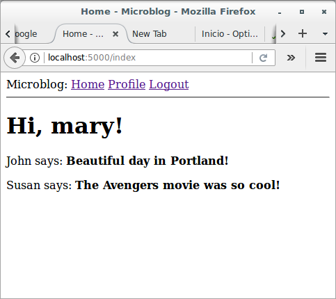
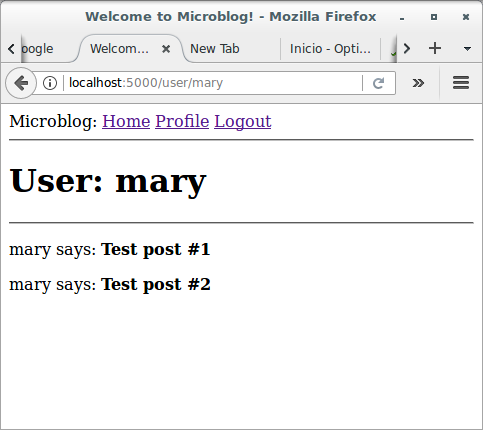
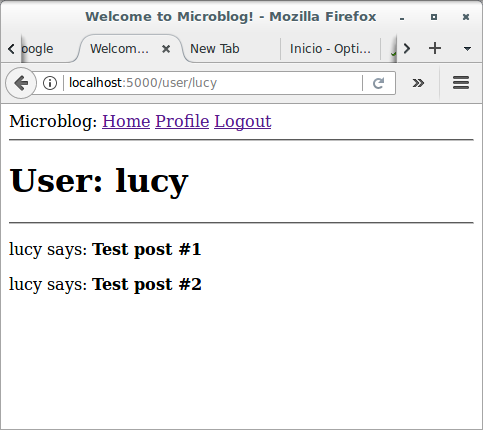

# Basic Development with Flask and Microblog

## Profile Page and Avatars

### Introduction

This section is going to be dedicated to adding user profile pages to 
the application. A user profile page is a page in which information 
about a user is presented, often with information entered by the users 
themselves. I will show you how to generate profile pages for all users 
dynamically, and then I'll add a small profile editor that users can use 
to enter their information.

### User Profile Page

To create a user profile page, let's first write a new view function 
that maps to the */user/<username>* URL:

```python
# app/routes.py: User profile view function
from flask import render_template, flash, redirect, url_for, request
from app import app, db
from app.forms import LoginForm, RegistrationForm
from flask_login import current_user, login_user, logout_user, login_required
from app.models import User
from werkzeug.urls import url_parse


@app.route('/')
@app.route('/index')
@login_required
def index():
    posts = [
        {
            'author': {'username': 'John'},
            'body': 'Beautiful day in Portland!'
        },
        {
            'author': {'username': 'Susan'},
            'body': 'The Avengers movie was so cool!'
        }
    ]
    return render_template('index.html', 
                           title = 'Home', 
                           posts = posts)

@app.route('/login', methods=['GET', 'POST'])
def login():
    if current_user.is_authenticated:
        return redirect(url_for('index'))
    form = LoginForm()
    if form.validate_on_submit():
        user = User.query.filter_by(username=form.username.data).first()
        if user is None or not user.check_password(form.password.data):
            flash('Invalid username or password')
            return redirect(url_for('login'))
        login_user(user, remember=form.remember_me.data)
        next_page = request.args.get('next')
        if not next_page or url_parse(next_page).netloc != '':
            next_page = url_for('index')
        return redirect(next_page)
    return render_template('login.html', title='Sign In', form=form)

@app.route('/logout')
def logout():
    logout_user()
    return redirect(url_for('index'))

@app.route('/register', methods=['GET', 'POST'])
def register():
    if current_user.is_authenticated:
        return redirect(url_for('index'))
    form = RegistrationForm()
    if form.validate_on_submit():
        user = User(username=form.username.data, email=form.email.data)
        user.set_password(form.password.data)
        db.session.add(user)
        db.session.commit()
        flash('Congratulations, you are now a registered user!')
        return redirect(url_for('login'))
    return render_template('register.html', title='Register', form=form)

@app.route('/user/<username>')
@login_required
def user(username):
    user = User.query.filter_by(username=username).first_or_404()
    posts = [
        {'author': user, 'body': 'Test post #1'}, 
        {'author': user, 'body': 'Test post #2'}
    ]
    return render_template('user.html', user=user, posts=posts)
```

The `@app.route` decorator that I used to declare this view function 
looks a little bit different than the previous ones. In this case I have 
a dynamic component in it, which is indicated as the `<username>` URL 
component that is surrounded by `<` and `>`. When a route has a dynamic 
component, Flask will accept any text in that portion of the URL, and 
will invoke the view function with the actual text as an argument. For 
example, if the client browser requests URL `/user/mary`, the view 
function is going to be called with the argument `username` set 
to `'susan'`. This view function is only going to be accessible to 
logged in users, so I have added the `@login_required` decorator from 
Flask-Login.

The implementation of this view function is fairly simple. I first try 
to load the user from the database using a query by the username. You 
have seen before that a database query can be executed by 
calling `all()` if you want to get all results, or `first()` if you want 
to get just the first result or `None` if there are zero results. In 
this view function I'm using a variant of `first()` 
called `first_or_404()`, which works exactly like `first()` when there 
are results, but in the case that there are no results automatically 
sends a [404 error](https://en.wikipedia.org/wiki/HTTP_404) back to the 
client. Executing the query in this way I save myself from checking if 
the query returned a user, because when the username does not exist in 
the database the function will not return and instead a 404 exception 
will be raised.

If the database query does not trigger a 404 error, then that means that 
a user with the given username was found. Next, I initialize a fake list 
of posts for this user, finally render a new *user.html* template to 
which I pass the user object and the list of posts.

The *user.html* template is shown below:

```html



    <h1>User: {{ user.username }}</h1>
    <hr>
    
    <p>
    {{ post.author.username }} says: <b>{{ post.body }}</b>
    </p>
    

```

The profile page is now complete, but a link to it does not exist 
anywhere in the web site. To make it a bit more easy for users to check 
their own profile, I'm going to add a link to it in the navigation bar 
at the top:

```html
<html>
    <head>
        
        <title>{{ title }} - Microblog</title>
        
        <title>Welcome to Microblog!</title>
        
    </head>
    <body>
        <div>
            Microblog: 
            <a href="{{ url_for('index') }}">Home</a>
            
            <a href="{{ url_for('login') }}">Login</a>
            
            <a href="{{ url_for('user', username=current_user.username) }}">Profile</a>
            <a href="{{ url_for('logout') }}">Logout</a>
            
        </div>
        <hr>
        
        
        <ul>
            
            <li>{{ message }}</li>
            
        </ul>
        
        
        
    </body>
</html>
```

The only interesting change here is the `url_for()` call that is used to 
generate the link to the profile page. Since the user profile view 
function takes a dynamic argument, the `url_for()` function receives a 
value for it as a keyword argument. Since this is a link that points to 
the logged in's user profile, I can use Flask-Login's `current_user` to 
generate the correct URL.





Give the application a try now. Clicking on the `Profile` link at the 
top should take you to your own user page. At this point there are no 
links that will take to the profile page of other users, but if you want 
to access those pages you can type the URL by hand in the browser's 
address bar. For example, if you have a user named "lucy" registered on 
your application, you can view the corresponding user profile by 
typing *http://localhost:5000/user/lucy* in the address bar.


