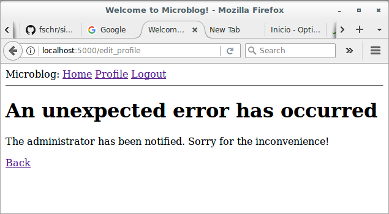

# Basic Development with Flask and Microblog

## Error Handling

### Introduction

In this section, I'm taking a break from coding new features into my 
microblog application, and instead will discuss a few strategies to deal 
with bugs, which invariably make an appearance in any software project. 
To help illustrate this topic, I intentionally let a bug slip in the 
code that I've added in the previous part. Before you continue reading, 
see if you can find it!

### Error Handling in Flask

What happens when an error occurs in a Flask application? The best way 
to find out is to experience it first hand. Go ahead and start the 
application, and make sure you have at least two users registered. Log 
in as one of the users, open the profile page and click the "Edit" link. 
In the profile editor, try to change the username to the username of 
another user that is already registered, and boom! This is going to 
bring a scary looking "Internal Server Error" page. Let's see:


If you look in the terminal session where the application is running, 
you will see a [stack trace](https://en.wikipedia.org/wiki/Stack_trace) 
of the error. Stack traces are extremely useful in debugging errors, 
because they show the sequence of calls in that stack, all the way to 
the line that produced the error:

```
(venv) $ flask run
 * Serving Flask app "microblog"
 * Running on http://127.0.0.1:5000/ (Press CTRL+C to quit)
127.0.0.1 - - [12/May/2018 09:10:59] "GET /login HTTP/1.1" 200 -
127.0.0.1 - - [12/May/2018 09:11:11] "POST /login HTTP/1.1" 302 -
127.0.0.1 - - [12/May/2018 09:11:11] "GET /index HTTP/1.1" 200 -
127.0.0.1 - - [12/May/2018 09:11:26] "GET /user/mary HTTP/1.1" 200 -
127.0.0.1 - - [12/May/2018 09:11:45] "GET /edit_profile HTTP/1.1" 200 -
[2018-05-12 09:14:32,251] ERROR in app: Exception on /edit_profile [POST]
Traceback (most recent call last):
  File "~/microblog.git/venv/lib/python3.6/site-packages/sqlalchemy/engine/base.py", line 1193, in _execute_context
    context)
  File "~/microblog.git/venv/lib/python3.6/site-packages/sqlalchemy/engine/default.py", line 507, in do_execute
    cursor.execute(statement, parameters)
sqlite3.IntegrityError: UNIQUE constraint failed: user.username

The above exception was the direct cause of the following exception:

Traceback (most recent call last):
  File "~/microblog.git/venv/lib/python3.6/site-packages/flask/app.py", line 1982, in wsgi_app
    response = self.full_dispatch_request()
  File "~/microblog.git/venv/lib/python3.6/site-packages/flask/app.py", line 1614, in full_dispatch_request
    rv = self.handle_user_exception(e)
  File "~/microblog.git/venv/lib/python3.6/site-packages/flask/app.py", line 1517, in handle_user_exception
    reraise(exc_type, exc_value, tb)
  File "~/microblog.git/venv/lib/python3.6/site-packages/flask/_compat.py", line 33, in reraise
    raise value
  File "~/microblog.git/venv/lib/python3.6/site-packages/flask/app.py", line 1612, in full_dispatch_request
    rv = self.dispatch_request()
  File "~/microblog.git/venv/lib/python3.6/site-packages/flask/app.py", line 1598, in dispatch_request
    return self.view_functions[rule.endpoint](**req.view_args)
  File "~/microblog.git/venv/lib/python3.6/site-packages/flask_login/utils.py", line 261, in decorated_view
    return func(*args, **kwargs)
  File "~/microblog.git/app/routes.py", line 89, in edit_profile
    db.session.commit()
  File "~/microblog.git/venv/lib/python3.6/site-packages/sqlalchemy/orm/scoping.py", line 153, in do
    return getattr(self.registry(), name)(*args, **kwargs)
  File "~/microblog.git/venv/lib/python3.6/site-packages/sqlalchemy/orm/session.py", line 943, in commit
    self.transaction.commit()
  File "~/microblog.git/venv/lib/python3.6/site-packages/sqlalchemy/orm/session.py", line 467, in commit
    self._prepare_impl()
  File "~/microblog.git/venv/lib/python3.6/site-packages/sqlalchemy/orm/session.py", line 447, in _prepare_impl
    self.session.flush()
  File "~/microblog.git/venv/lib/python3.6/site-packages/sqlalchemy/orm/session.py", line 2254, in flush
    self._flush(objects)
  File "~/microblog.git/venv/lib/python3.6/site-packages/sqlalchemy/orm/session.py", line 2380, in _flush
    transaction.rollback(_capture_exception=True)
  File "~/microblog.git/venv/lib/python3.6/site-packages/sqlalchemy/util/langhelpers.py", line 66, in __exit__
    compat.reraise(exc_type, exc_value, exc_tb)
  File "~/microblog.git/venv/lib/python3.6/site-packages/sqlalchemy/util/compat.py", line 187, in reraise
    raise value
  File "~/microblog.git/venv/lib/python3.6/site-packages/sqlalchemy/orm/session.py", line 2344, in _flush
    flush_context.execute()
  File "~/microblog.git/venv/lib/python3.6/site-packages/sqlalchemy/orm/unitofwork.py", line 391, in execute
    rec.execute(self)
  File "~/microblog.git/venv/lib/python3.6/site-packages/sqlalchemy/orm/unitofwork.py", line 556, in execute
    uow
  File "~/microblog.git/venv/lib/python3.6/site-packages/sqlalchemy/orm/persistence.py", line 177, in save_obj
    mapper, table, update)
  File "~/microblog.git/venv/lib/python3.6/site-packages/sqlalchemy/orm/persistence.py", line 768, in _emit_update_statements
    execute(statement, multiparams)
  File "~/microblog.git/venv/lib/python3.6/site-packages/sqlalchemy/engine/base.py", line 948, in execute
    return meth(self, multiparams, params)
  File "~/microblog.git/venv/lib/python3.6/site-packages/sqlalchemy/sql/elements.py", line 269, in _execute_on_connection
    return connection._execute_clauseelement(self, multiparams, params)
  File "~/microblog.git/venv/lib/python3.6/site-packages/sqlalchemy/engine/base.py", line 1060, in _execute_clauseelement
    compiled_sql, distilled_params
  File "~/microblog.git/venv/lib/python3.6/site-packages/sqlalchemy/engine/base.py", line 1200, in _execute_context
    context)
  File "~/microblog.git/venv/lib/python3.6/site-packages/sqlalchemy/engine/base.py", line 1413, in _handle_dbapi_exception
    exc_info
  File "~/microblog.git/venv/lib/python3.6/site-packages/sqlalchemy/util/compat.py", line 203, in raise_from_cause
    reraise(type(exception), exception, tb=exc_tb, cause=cause)
  File "~/microblog.git/venv/lib/python3.6/site-packages/sqlalchemy/util/compat.py", line 186, in reraise
    raise value.with_traceback(tb)
  File "~/microblog.git/venv/lib/python3.6/site-packages/sqlalchemy/engine/base.py", line 1193, in _execute_context
    context)
  File "~/microblog.git/venv/lib/python3.6/site-packages/sqlalchemy/engine/default.py", line 507, in do_execute
    cursor.execute(statement, parameters)
sqlalchemy.exc.IntegrityError: (sqlite3.IntegrityError) UNIQUE constraint failed: user.username [SQL: 'UPDATE user SET username=?, about_me=? WHERE user.id = ?'] [parameters: ('lucy', 'Hi! I like to read novels and fiction books. I love the new version of "Dr. Who"!', 1)] (Background on this error at: http://sqlalche.me/e/gkpj)
127.0.0.1 - - [12/May/2018 09:14:32] "POST /edit_profile HTTP/1.1" 500 -
```

The stack trace indicates what is the bug. The application allows a user 
to change the username, and does not validate that the new username 
chosen does not collide with another user already in the system. The 
error comes from SQLAlchemy, which tries to write the new username to 
the database, but the database rejects it because the `username` column 
is defined with `unique=True`.

It is important to note that the error page that is presented to the 
user does not provide much information about the error, and that is 
good. I definitely do not want users to learn that the crash was caused 
by a database error, or what database I'm using, or what are some of the 
table and field names in my database. All that information should be 
kept internal.

There are a few things that are far from ideal. I have an error page 
that is very ugly and does not match the application layout. I also have 
important application stack traces being dumped on a terminal that I 
need to constantly watch to make sure I don't miss any errors. And of 
course I have a bug to fix. I'm going to address all these issues, but 
first, let's talk about Flask's *debug mode*.

### Debug Mode

The way you saw that errors are handled above is great for a system that 
is running on a production server. If there is an error, the user gets a 
vague error page (though I'm going to make this error page nicer), and 
the important details of the error are in the server process output or 
in a log file.

But when you are developing your application, you can enable debug mode, 
a mode in which Flask outputs a really nice debugger directly on your 
browser. To activate debug mode, stop the application, and then set the 
following environment variable:

```
(venv) $ export FLASK_DEBUG=1
```

After you set `FLASK_DEBUG`, restart the server. The output on your 
terminal is going to be slightly different than what you are used to 
see:

```
(venv) $ flask run
 * Serving Flask app "microblog"
 * Forcing debug mode on
 * Running on http://127.0.0.1:5000/ (Press CTRL+C to quit)
 * Restarting with stat
 * Debugger is active!
 * Debugger PIN: 490-502-390
```

Now make the application crash one more time to see the interactive 
debugger in your browser:


The debugger allows you expand each stack frame and see the 
corresponding source code. You can also open a Python prompt on any of 
the frames and execute any valid Python expressions, for example to 
check the values of variables.

It is extremely important that you never run a Flask application in 
debug mode on a production server. The debugger allows the user to 
remotely execute code in the server, so it can be an unexpected gift to 
a malicious user who wants to infiltrate your application or your 
server. As an additional security measure, the debugger running in the 
browser starts locked, and on first use will ask for a PIN number, which 
you can see in the output of the `flask run` command.

Since I am in the topic of debug mode, I should mention the second 
important feature that is enabled with debug mode, which is 
the *reloader*. This is a very useful development feature that 
automatically restarts the application when a source file is modified. 
If you run `flask run` while in debug mode, you can then work on your 
application and any time you save a file, the application will restart 
to pick up the new code.

### Custom Error Pages

Flask provides a mechanism for an application to install its own error 
pages, so that your users don't have to see the plain and boring default 
ones. As an example, let's define custom error pages for the HTTP errors 
404 and 500, the two most common ones. Defining pages for other errors 
works in the same way.

To declare a custom error handler, the `@errorhandler` decorator is 
used. I'm going to put my error handlers in a new *app/errors.py* 
module. Let's see the file:

```python
# app/errors.py: Custom error handlers
from flask import render_template
from app import app, db

@app.errorhandler(404)
def not_found_error(error):
    return render_template('404.html'), 404

@app.errorhandler(500)
def internal_error(error):
    db.session.rollback()
    return render_template('500.html'), 500
```

The error functions work very similarly to view functions. For these two 
errors, I'm returning the contents of their respective templates. Note 
that both functions return a second value after the template, which is 
the error code number. For all the view functions that I created so far, 
I did not need to add a second return value because the default of 200 
(the status code for a successful response) is what I wanted. In this 
case these are error pages, so I want the status code of the response to 
reflect that.

The error handler for the 500 errors could be invoked after a database 
error, which was actually the case with the username duplicate above. To 
make sure any failed database sessions do not interfere with any 
database accesses triggered by the template, I issue a session rollback. 
This resets the session to a clean state.

Here is the template for the 404 error:

```html



    <h1>File Not Found</h1>
    <p><a href="{{ url_for('index') }}">Back</a></p>

```

And here is the one for the 500 error:

```html



    <h1>An unexpected error has occurred</h1>
    <p>The administrator has been notified. Sorry for the inconvenience!</p>
    <p><a href="{{ url_for('index') }}">Back</a></p>

```

Both templates inherit from the `base.html` template, so that the error 
page has the same look and feel as the normal pages of the application.

To get these error handlers registered with Flask, I need to import the 
new *app/errors.py* module after the application instance is created:

```python
# app/__init__.py: Import error handlers
# ...

from app import routes, models, errors
```

If you set `FLASK_DEBUG=0` in your terminal session and then trigger the 
duplicate username bug one more time, you are going to see a slightly 
more friendly error page.



### Sending Errors by Email

The other problem with the default error handling provided by Flask is 
that there are no notifications, stack trace for errors are printed to 
the terminal, which means that the output of the server process needs to 
be monitored to discover errors. When you are running the application 
during development, this is perfectly fine, but once the application is 
deployed on a production server, nobody is going to be looking at the 
output, so a more robust solution needs to be put in place.

I think it is very important that I take a proactive approach regarding 
errors. If an error occurs on the production version of the application, 
I want to know right away. So my first solution is going to be to 
configure Flask to send me an email immediately after an error, with the 
stack trace of the error in the email body.

The first step is to add the email server details to the configuration 
file:

```python
# config.py: Email configuration
import secrets
import os
basedir = os.path.abspath(os.path.dirname(__file__))

class Config(object):
    SECRET_KEY = os.environ.get('SECRET_KEY') or secrets.token_hex(32)
    SQLALCHEMY_DATABASE_URI = os.environ.get('DATABASE_URL') or \
        'sqlite:///' + os.path.join(basedir, 'app.db')
    SQLALCHEMY_TRACK_MODIFICATIONS = False
    MAIL_SERVER = os.environ.get('MAIL_SERVER')
    MAIL_PORT = int(os.environ.get('MAIL_PORT') or 25)
    MAIL_USE_TLS = os.environ.get('MAIL_USE_TLS') is not None
    MAIL_USERNAME = os.environ.get('MAIL_USERNAME')
    MAIL_PASSWORD = os.environ.get('MAIL_PASSWORD')
    ADMINS = ['j.maita@3leautomation.com']
```

The configuration variables for email include the server and port, a 
boolean flag to enable encrypted connections, and optional username and 
password. The five configuration variables are sourced from their 
environment variable counterparts. If the email server is not set in the 
environment, then I will use that as a sign that emailing errors needs 
to be disabled. The email server port can also be given in an 
environment variable, but if not set, the standard port 25 is used. 
Email server credentials are by default not used, but can be provided if 
needed. The `ADMINS` configuration variable is a list of the email 
addresses that will receive error reports, so your own email address 
should be in that list.

Flask uses Python's `logging` package to write its logs, and this 
package already has the ability to send logs by email. All I need to do 
to get emails sent out on errors is to add 
a [SMTPHandler](https://docs.python.org/3.6/library/logging.handlers.html#smtphandler) 
instance to the Flask logger object, which is `app.logger`:

```python
# app/__init__.py: Log errors by email
import logging
from logging.handlers import SMTPHandler

# ...

if not app.debug:
    if app.config['MAIL_SERVER']:
        auth = None
        if app.config['MAIL_USERNAME'] or app.config['MAIL_PASSWORD']:
            auth = (app.config['MAIL_USERNAME'], app.config['MAIL_PASSWORD'])
        secure = None
        if app.config['MAIL_USE_TLS']:
            secure = ()
        mail_handler = SMTPHandler(
            mailhost=(app.config['MAIL_SERVER'], app.config['MAIL_PORT']),
            fromaddr='no-reply@' + app.config['MAIL_SERVER'],
            toaddrs=app.config['ADMINS'], subject='Microblog Failure',
            credentials=auth, secure=secure)
        mail_handler.setLevel(logging.ERROR)
        app.logger.addHandler(mail_handler)
```

As you can see, I'm only going to enable the email logger when the 
application is running without debug mode, which is indicated 
by `app.debug` being `True`, and also when the email server exists in 
the configuration.

Setting up the email logger is somewhat tedious due to having to handle 
optional security options that are present in many email servers. But in 
essence, the code above creates a `SMTPHandler` instance, sets its level 
so that it only reports errors and not warnings, informational or 
debugging messages, and finally attaches it to the `app.logger` object 
from Flask.

There are two approaches to test this feature. The easiest one is to use 
the SMTP debugging server from Python. This is a fake email server that 
accepts emails, but instead of sending them, it prints them to the 
console. To run this server, open a second terminal session and run the 
following command on it:

```
(venv) $ python -m smtpd -n -c DebuggingServer localhost:8025
```

Leave the debugging SMTP server running and go back to your first 
terminal and set `export MAIL_SERVER=localhost` 
and `export MAIL_PORT=8025` in the environment. Make sure 
the `FLASK_DEBUG` variable is set to `0` or not set at all, since the 
application will not send emails in debug mode. Run the application and 
trigger the SQLAlchemy error one more time to see how the terminal 
session running the fake email server shows an email with the full stack 
trace of the error.

A second testing approach for this feature is to configure a real email 
server. Below is the configuration to use your Gmail account's email 
server:

```
(venv) $ export MAIL_SERVER=smtp.googlemail.com
(venv) $ export MAIL_PORT=587
(venv) $ export MAIL_USE_TLS=1
(venv) $ export MAIL_USERNAME=<your-gmail-username>
(venv) $ export MAIL_PASSWORD=<your-gmail-password>
```

The security features in your Gmail account may prevent the application 
from sending emails through it unless you explicitly allow "less secure 
apps" access to your Gmail account. You can read about 
this [here](https://support.google.com/accounts/answer/6010255?hl=en), 
and if you are concerned about the security of your account, you can 
create a secondary account that you configure just for testing emails, 
or you can enable less secure apps only temporarily to run this test and 
then revert back to the default.

### Logging to a File

Receiving errors via email is nice, but sometimes this isn't enough. 
There are some failure conditions that do not end in a Python exception 
and are not a major problem, but they may still be interesting enough to 
save for debugging purposes. For this reason, I'm also going to maintain 
a log file for the application.

To enable a file-based log handler, this time of 
type [RotatingFileHandler](https://docs.python.org/3.6/library/logging.handlers.html#rotatingfilehandler), 
needs to be attached to the application logger, in a similar way to the 
email handler. Let's see:

```python
# app/__init__.py: Logging to a file
# ...
from logging.handlers import RotatingFileHandler
import os

# ...

if not app.debug:
    # ...

    if not os.path.exists('logs'):
        os.mkdir('logs')
    file_handler = RotatingFileHandler('logs/microblog.log', 
                                       maxBytes=10240, 
                                       backupCount=10)
    file_handler.setFormatter(logging.Formatter(
        '%(asctime)s %(levelname)s: %(message)s [in %(pathname)s:%(lineno)d]'))
    file_handler.setLevel(logging.INFO)
    app.logger.addHandler(file_handler)

    app.logger.setLevel(logging.INFO)
    app.logger.info('Microblog startup')
```

I'm writing the log file with name `microblog.log` in a *logs* 
directory, which I create if it doesn't already exist.

The `RotatingFileHandler` class is nice because it rotates the logs, 
ensuring that the log files do not grow too large when the application 
runs for a long time. In this case I'm limiting the size of the log file 
to 10KB, and I'm keeping the last ten log files as backup.

The `logging.Formatter` class provides custom formatting for the log 
messages. Since these messages are going to a file, I want them to have 
as much information as possible. So I'm using a format that includes the 
timestamp, the logging level, the message and the source file and line 
number from where the log entry originated.

To make the logging more useful, I'm also lowering the logging level to 
the `INFO` category, both in the application logger and the file logger 
handler. In case you are not familiar with the logging categories, they 
are `DEBUG`, `INFO`, `WARNING`, `ERROR` and `CRITICAL` in increasing 
order of severity.

As a first interesting use of the log file, the server writes a line to 
the logs each time it starts. When this application runs on a production 
server, these log entries will tell you when the server was restarted.
