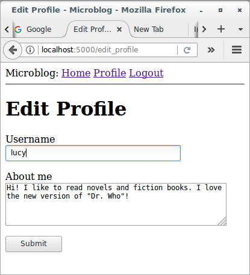
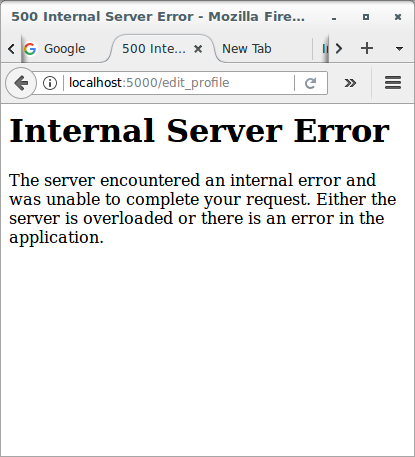
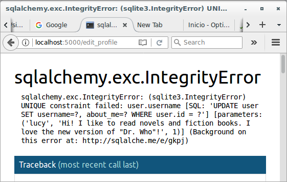

# Basic Development with Flask and Microblog

## Error Handling

### Introduction

In this section, I'm taking a break from coding new features into my 
microblog application, and instead will discuss a few strategies to deal 
with bugs, which invariably make an appearance in any software project. 
To help illustrate this topic, I intentionally let a bug slip in the 
code that I've added in the previous part. Before you continue reading, 
see if you can find it!

### Error Handling in Flask

What happens when an error occurs in a Flask application? The best way 
to find out is to experience it first hand. Go ahead and start the 
application, and make sure you have at least two users registered. Log 
in as one of the users, open the profile page and click the "Edit" link. 
In the profile editor, try to change the username to the username of 
another user that is already registered, and boom! This is going to 
bring a scary looking "Internal Server Error" page. Let's see:





If you look in the terminal session where the application is running, 
you will see a [stack trace](https://en.wikipedia.org/wiki/Stack_trace) 
of the error. Stack traces are extremely useful in debugging errors, 
because they show the sequence of calls in that stack, all the way to 
the line that produced the error:

```
(venv) $ flask run
 * Serving Flask app "microblog"
 * Running on http://127.0.0.1:5000/ (Press CTRL+C to quit)
127.0.0.1 - - [12/May/2018 09:10:59] "GET /login HTTP/1.1" 200 -
127.0.0.1 - - [12/May/2018 09:11:11] "POST /login HTTP/1.1" 302 -
127.0.0.1 - - [12/May/2018 09:11:11] "GET /index HTTP/1.1" 200 -
127.0.0.1 - - [12/May/2018 09:11:26] "GET /user/mary HTTP/1.1" 200 -
127.0.0.1 - - [12/May/2018 09:11:45] "GET /edit_profile HTTP/1.1" 200 -
[2018-05-12 09:14:32,251] ERROR in app: Exception on /edit_profile [POST]
Traceback (most recent call last):
  File "~/microblog.git/venv/lib/python3.6/site-packages/sqlalchemy/engine/base.py", line 1193, in _execute_context
    context)
  File "~/microblog.git/venv/lib/python3.6/site-packages/sqlalchemy/engine/default.py", line 507, in do_execute
    cursor.execute(statement, parameters)
sqlite3.IntegrityError: UNIQUE constraint failed: user.username

The above exception was the direct cause of the following exception:

Traceback (most recent call last):
  File "~/microblog.git/venv/lib/python3.6/site-packages/flask/app.py", line 1982, in wsgi_app
    response = self.full_dispatch_request()
  File "~/microblog.git/venv/lib/python3.6/site-packages/flask/app.py", line 1614, in full_dispatch_request
    rv = self.handle_user_exception(e)
  File "~/microblog.git/venv/lib/python3.6/site-packages/flask/app.py", line 1517, in handle_user_exception
    reraise(exc_type, exc_value, tb)
  File "~/microblog.git/venv/lib/python3.6/site-packages/flask/_compat.py", line 33, in reraise
    raise value
  File "~/microblog.git/venv/lib/python3.6/site-packages/flask/app.py", line 1612, in full_dispatch_request
    rv = self.dispatch_request()
  File "~/microblog.git/venv/lib/python3.6/site-packages/flask/app.py", line 1598, in dispatch_request
    return self.view_functions[rule.endpoint](**req.view_args)
  File "~/microblog.git/venv/lib/python3.6/site-packages/flask_login/utils.py", line 261, in decorated_view
    return func(*args, **kwargs)
  File "~/microblog.git/app/routes.py", line 89, in edit_profile
    db.session.commit()
  File "~/microblog.git/venv/lib/python3.6/site-packages/sqlalchemy/orm/scoping.py", line 153, in do
    return getattr(self.registry(), name)(*args, **kwargs)
  File "~/microblog.git/venv/lib/python3.6/site-packages/sqlalchemy/orm/session.py", line 943, in commit
    self.transaction.commit()
  File "~/microblog.git/venv/lib/python3.6/site-packages/sqlalchemy/orm/session.py", line 467, in commit
    self._prepare_impl()
  File "~/microblog.git/venv/lib/python3.6/site-packages/sqlalchemy/orm/session.py", line 447, in _prepare_impl
    self.session.flush()
  File "~/microblog.git/venv/lib/python3.6/site-packages/sqlalchemy/orm/session.py", line 2254, in flush
    self._flush(objects)
  File "~/microblog.git/venv/lib/python3.6/site-packages/sqlalchemy/orm/session.py", line 2380, in _flush
    transaction.rollback(_capture_exception=True)
  File "~/microblog.git/venv/lib/python3.6/site-packages/sqlalchemy/util/langhelpers.py", line 66, in __exit__
    compat.reraise(exc_type, exc_value, exc_tb)
  File "~/microblog.git/venv/lib/python3.6/site-packages/sqlalchemy/util/compat.py", line 187, in reraise
    raise value
  File "~/microblog.git/venv/lib/python3.6/site-packages/sqlalchemy/orm/session.py", line 2344, in _flush
    flush_context.execute()
  File "~/microblog.git/venv/lib/python3.6/site-packages/sqlalchemy/orm/unitofwork.py", line 391, in execute
    rec.execute(self)
  File "~/microblog.git/venv/lib/python3.6/site-packages/sqlalchemy/orm/unitofwork.py", line 556, in execute
    uow
  File "~/microblog.git/venv/lib/python3.6/site-packages/sqlalchemy/orm/persistence.py", line 177, in save_obj
    mapper, table, update)
  File "~/microblog.git/venv/lib/python3.6/site-packages/sqlalchemy/orm/persistence.py", line 768, in _emit_update_statements
    execute(statement, multiparams)
  File "~/microblog.git/venv/lib/python3.6/site-packages/sqlalchemy/engine/base.py", line 948, in execute
    return meth(self, multiparams, params)
  File "~/microblog.git/venv/lib/python3.6/site-packages/sqlalchemy/sql/elements.py", line 269, in _execute_on_connection
    return connection._execute_clauseelement(self, multiparams, params)
  File "~/microblog.git/venv/lib/python3.6/site-packages/sqlalchemy/engine/base.py", line 1060, in _execute_clauseelement
    compiled_sql, distilled_params
  File "~/microblog.git/venv/lib/python3.6/site-packages/sqlalchemy/engine/base.py", line 1200, in _execute_context
    context)
  File "~/microblog.git/venv/lib/python3.6/site-packages/sqlalchemy/engine/base.py", line 1413, in _handle_dbapi_exception
    exc_info
  File "~/microblog.git/venv/lib/python3.6/site-packages/sqlalchemy/util/compat.py", line 203, in raise_from_cause
    reraise(type(exception), exception, tb=exc_tb, cause=cause)
  File "~/microblog.git/venv/lib/python3.6/site-packages/sqlalchemy/util/compat.py", line 186, in reraise
    raise value.with_traceback(tb)
  File "~/microblog.git/venv/lib/python3.6/site-packages/sqlalchemy/engine/base.py", line 1193, in _execute_context
    context)
  File "~/microblog.git/venv/lib/python3.6/site-packages/sqlalchemy/engine/default.py", line 507, in do_execute
    cursor.execute(statement, parameters)
sqlalchemy.exc.IntegrityError: (sqlite3.IntegrityError) UNIQUE constraint failed: user.username [SQL: 'UPDATE user SET username=?, about_me=? WHERE user.id = ?'] [parameters: ('lucy', 'Hi! I like to read novels and fiction books. I love the new version of "Dr. Who"!', 1)] (Background on this error at: http://sqlalche.me/e/gkpj)
127.0.0.1 - - [12/May/2018 09:14:32] "POST /edit_profile HTTP/1.1" 500 -
```

The stack trace indicates what is the bug. The application allows a user 
to change the username, and does not validate that the new username 
chosen does not collide with another user already in the system. The 
error comes from SQLAlchemy, which tries to write the new username to 
the database, but the database rejects it because the `username` column 
is defined with `unique=True`.

It is important to note that the error page that is presented to the 
user does not provide much information about the error, and that is 
good. I definitely do not want users to learn that the crash was caused 
by a database error, or what database I'm using, or what are some of the 
table and field names in my database. All that information should be 
kept internal.

There are a few things that are far from ideal. I have an error page 
that is very ugly and does not match the application layout. I also have 
important application stack traces being dumped on a terminal that I 
need to constantly watch to make sure I don't miss any errors. And of 
course I have a bug to fix. I'm going to address all these issues, but 
first, let's talk about Flask's *debug mode*.

### Debug Mode

The way you saw that errors are handled above is great for a system that 
is running on a production server. If there is an error, the user gets a 
vague error page (though I'm going to make this error page nicer), and 
the important details of the error are in the server process output or 
in a log file.

But when you are developing your application, you can enable debug mode, 
a mode in which Flask outputs a really nice debugger directly on your 
browser. To activate debug mode, stop the application, and then set the 
following environment variable:

```
(venv) $ export FLASK_DEBUG=1
```

After you set `FLASK_DEBUG`, restart the server. The output on your 
terminal is going to be slightly different than what you are used to 
see:

```
(venv) $ flask run
 * Serving Flask app "microblog"
 * Forcing debug mode on
 * Running on http://127.0.0.1:5000/ (Press CTRL+C to quit)
 * Restarting with stat
 * Debugger is active!
 * Debugger PIN: 490-502-390
```

Now make the application crash one more time to see the interactive 
debugger in your browser:



The debugger allows you expand each stack frame and see the 
corresponding source code. You can also open a Python prompt on any of 
the frames and execute any valid Python expressions, for example to 
check the values of variables.

It is extremely important that you never run a Flask application in 
debug mode on a production server. The debugger allows the user to 
remotely execute code in the server, so it can be an unexpected gift to 
a malicious user who wants to infiltrate your application or your 
server. As an additional security measure, the debugger running in the 
browser starts locked, and on first use will ask for a PIN number, which 
you can see in the output of the `flask run` command.

Since I am in the topic of debug mode, I should mention the second 
important feature that is enabled with debug mode, which is 
the *reloader*. This is a very useful development feature that 
automatically restarts the application when a source file is modified. 
If you run `flask run` while in debug mode, you can then work on your 
application and any time you save a file, the application will restart 
to pick up the new code.
