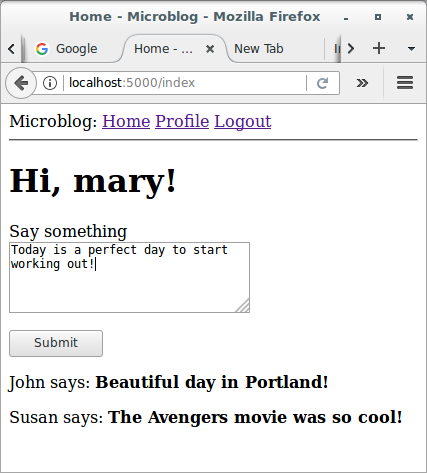
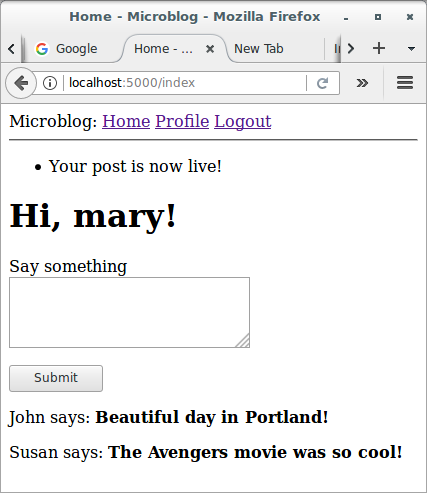
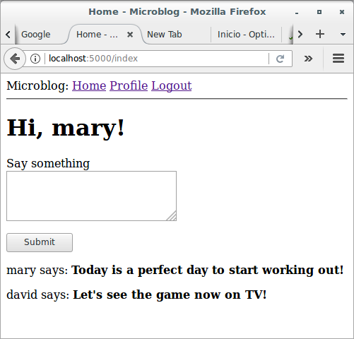
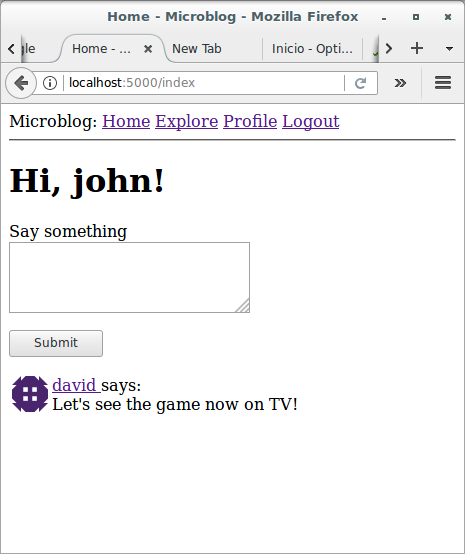
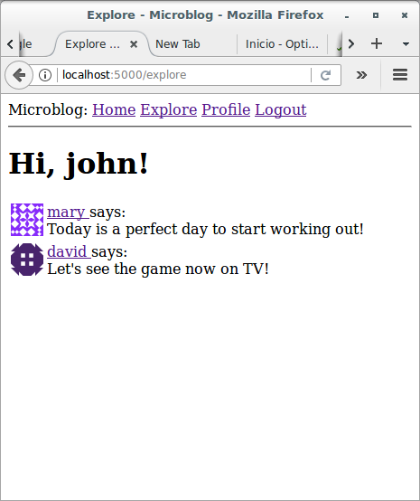
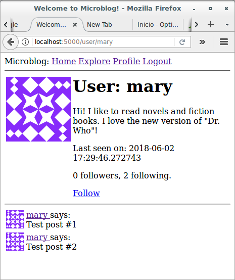
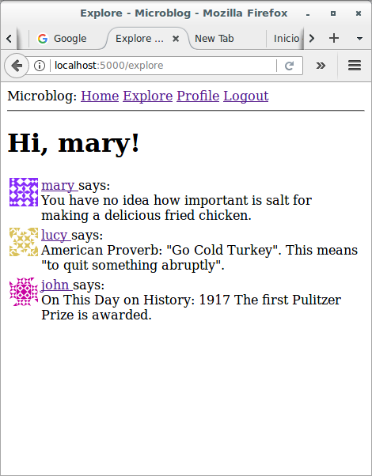
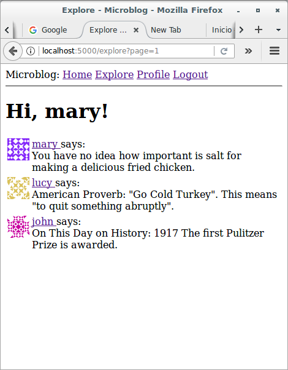
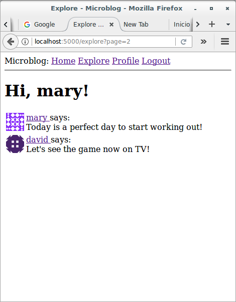
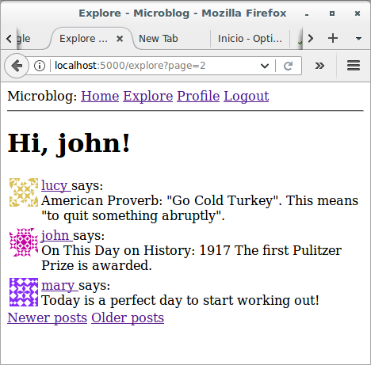

# Basic Development with Flask and Microblog

## Pagination

### Introduction

In the previous section, I have made several database changes necessary 
to support the "follower" paradigm that is so popular with social 
networks. With that functionality in place, I'm ready to remove the last 
piece of scaffolding that I have put in place in the beginning, the fake 
posts. In this section, the application will start accepting blog posts 
from users, and also deliver them in the home and profile pages.

### Submission of Blog Posts

Let's start with something simple. The home page needs to have a form in 
which users can type new posts. First I create a form class:

```python
# app/forms.py: Blog submission form
class PostForm(FlaskForm):
    post = TextAreaField('Say something', validators=[
        DataRequired(), Length(min=1, max=140)])
    submit = SubmitField('Submit')
```

Next, I can add this form to the template for the main page of the 
application:

```html



    <h1>Hi, {{ current_user.username }}!</h1>
    <form action="" method="post">
        {{ form.hidden_tag() }}
        <p>
            {{ form.post.label }}<br>
            {{ form.post(cols=32, rows=4) }}<br>
            
            <span style="color: red;">[{{ error }}]</span>
            
        </p>
        <p>{{ form.submit() }}</p>
    </form>
    
    <p>{{ post.author.username }} says: <b>{{ post.body }}</b></p>
    

```

The changes in this template are similar to how previous forms were 
handled. The final part is to add the form creation and handling in the 
view function:

```python
# app/routes.py: Post submission form in index view function
from app.forms import PostForm
from app.models import Post

@app.route('/', methods=['GET', 'POST'])
@app.route('/index', methods=['GET', 'POST'])
@login_required
def index():
    form = PostForm()
    if form.validate_on_submit():
        post = Post(body=form.post.data, author=current_user)
        db.session.add(post)
        db.session.commit()
        flash('Your post is now live!')
        return redirect(url_for('index'))
    posts = [
        {
            'author': {'username': 'John'},
            'body': 'Beautiful day in Portland!'
        },
        {
            'author': {'username': 'Susan'},
            'body': 'The Avengers movie was so cool!'
        }
    ]
    return render_template('index.html', 
                           title = 'Home', 
                           posts = posts, 
                           form = form)
```

Let's review the changes in this view function one by one:

* I'm now importing the `Post` and `PostForm` classes.
* I accept `POST` requests in both routes associated with the `index` 
view function in addition to `GET` requests, since this view function 
will now receive form data.
* The form processing logic inserts a new `Post` record into the 
database.
* The template receives the `form` object as an additional argument, so 
that it can render the text field.

Before I continue, I wanted to mention something important related to 
processing of web forms. Notice how after I process the form data, I end 
the request by issuing a redirect to the home page. I could have easily 
skipped the redirect and allowed the function to continue down into the 
template rendering part, since this is already the index view function.

So, why the redirect? It is a standard practice to respond to a `POST` 
request generated by a web form submission with a redirect. This helps 
mitigate an annoyance with how the refresh command is implemented in web 
browsers. All the web browser does when you hit the refresh key is to 
re-issue the last request. If a `POST` request with a form submission 
returns a regular response, then a refresh will re-submit the form. 
Because this is unexpected, the browser is going to ask the user to 
confirm the duplicate submission, but most users will not understand 
what the browser is asking them. But if a `POST` request is answered 
with a redirect, the browser is now instructed to send a `GET` request 
to grab the page indicated in the redirect, so now the last request is 
not a `POST` request anymore, and the refresh command works in a more 
predictable way.

This simple trick is called the [Post/Redirect/Get](https://en.wikipedia.org/wiki/Post/Redirect/Get) 
pattern. It avoids inserting duplicate posts when a user inadvertently 
refreshes the page after submitting a web form.





### Displaying Blog Posts

If you recall, I created a couple of fake blog posts that I've been 
displaying in the home page for a long time. These fake objects are 
created explicitly in the `index` view function as a simple Python list:

```python
    posts = [
        {
            'author': {'username': 'John'},
            'body': 'Beautiful day in Portland!'
        },
        {
            'author': {'username': 'Susan'},
            'body': 'The Avengers movie was so cool!'
        }
    ]
```

But now I have the `followed_posts()` method in the `User` model that 
returns a query for the posts that a given user wants to see. So now I 
can replace the fake posts with real posts:

```python
# app/routes.py: Display real posts in home page
@app.route('/', methods=['GET', 'POST'])
@app.route('/index', methods=['GET', 'POST'])
@login_required
def index():
    # ...
    posts = current_user.followed_posts().all()
    return render_template('index.html', 
                           title = 'Home', 
                           posts = posts, 
                           form = form)
```

The `followed_posts` method of the `User` class returns a SQLAlchemy 
query object that is configured to grab the posts the user is interested 
in from the database. Calling `all()` on this query triggers its 
execution, with the return value being a list with all the results. So I 
end up with a structure that is very much alike the one with fake posts 
that I have been using until now. It's so close that the template does 
not even need to change.



### Making It Easier to Find Users to Follow

As I'm sure you noticed, the application as it is does not do a great 
job at letting users find other users to follow. In fact, there is 
actually no way to see what other users are there at all. I'm going to 
address that with a few simple changes.

I'm going to create a new page that I'm going to call the "Explore" 
page. This page will work like the home page, but instead of only 
showing posts from followed users, it will show a global post stream 
from all users. Here is the new explore view function:

```python
# app/routes.py: Explore view function
@app.route('/explore')
@login_required
def explore():
    posts = Post.query.order_by(Post.timestamp.desc()).all()
    return render_template('index.html', 
                           title = 'Explore', 
                           posts = posts)
```

Did you notice something odd in this view function? 
The `render_template()` call references the *index.html* template, which 
I'm using in the main page of the application. Since this page is going 
to be very similar to the main page, I decided to reuse the template. 
But one difference with the main page is that in the explore page I do 
not want to have a form to write blog posts, so in this view function I 
did not include the `form` argument in the template call.

To prevent the *index.html* template from crashing when it tries to 
render a web form that does not exist, I'm going to add a conditional 
that only renders the form if it is defined:

```html



    <h1>Hi, {{ current_user.username }}!</h1>
    
    <form action="" method="post">
        ...
    </form>
    
    ...

```

I'm also going to add a link to this new page in the navigation bar:

```html
            <a href="{{ url_for('explore') }}">Explore</a>
```

Remember the *_post.html* sub-template that I have introduced previously 
to render blog posts in the user profile page? This was a small template 
that was included from the user profile page template, and was separate 
so that it can also be used from other templates. I'm now going to make 
a small improvement to it, which is to show the username of the blog 
post author as a link:

```html
    <table>
        <tr valign="top">
            <td></td>
            <td>
                <a href="{{ url_for('user', username=post.author.username) }}">
                    {{ post.author.username }}
                </a>
                says:<br>{{ post.body }}
            </td>
        </tr>
    </table>
```

I can now use this sub-template to render blog posts in the home and 
explore pages:

```html
    ...
    
        
    
    ...
```

The sub-template expects a variable named `post` to exist, and that is 
how the loop variable in the index template is named, so that works 
perfectly.

With these small changes, the usability of the application has improved 
considerably. Now a user can visit the explore page to read blog posts 
from unknown users and based on those posts find new users to follow, 
which can be done by simply clicking on a username to access the profile 
page. Amazing, right?

At this point I suggest you to try the application once again, so that 
you experience these last user interface improvements.







### Pagination of Blog Posts

The application is looking better than ever, but showing all of the 
followed posts in the home page is going to become a problem sooner 
rather than later. What happens if a user has a thousand followed posts? 
Or a million? As you can imagine, managing such a large list of posts 
will be extremely slow and inefficient.

To address that problem, I'm going to *paginate* the post list. This 
means that initially I'm going to show just a limited number of posts at 
a time, and include links to navigate through the entire list of posts. 
Flask-SQLAlchemy supports pagination natively with the `paginate()` 
query method. If for example, I want to get the first twenty followed 
posts of the user, I can replace the `all()` call that terminates the 
query with:

```python
>>> user.followed_posts().paginate(1, 20, False).items
```

The `paginate` method can be called on any query object from 
Flask-SQLAlchemy. It takes three arguments:

* the page number, starting from 1
* the number of items per page
* an error flag. If `True`, when an out of range page is requested a 404 
error will be automatically returned to the client. If `False`, an empty 
list will be returned for out of range pages.

The return value from `paginate` is a `Pagination` object. The `items` 
attribute of this object contains the list of items in the requested 
page. There are other useful things in the `Pagination` object that I 
will discuss later.

Now let's think about how I can implement pagination in the `index()` 
view function. I can start by adding a configuration item to the 
application that determines how many items will be displayed per page.

```python
# config.py: Posts per page configuration
class Config(object):
    # ...
    POSTS_PER_PAGE = 3
```

It is a good idea to have these application-wide "knobs" that can change 
behaviors in the configuration file, because then I can go to a single 
place to make adjustments. In the final application I will of course use 
a larger number than three items per page, but for testing it is useful 
to work with small numbers.

Next, I need to decide how the page number is going to be incorporated 
into application URLs. A fairly common way is to use a *query string* 
argument to specify an optional page number, defaulting to page 1 if it 
is not given. Here are some example URLs that show how I'm going to 
implement this:

* Page 1, implicit: *http://localhost:5000/index*
* Page 1, explicit: *http://localhost:5000/index?page=1*
* Page 3: *http://localhost:5000/index?page=3*

To access arguments given in the query string, I can use the 
Flask's `request.args` object. You have seen this already in previous 
sections, where I implemented user login URLs from Flask-Login that can 
include a `next` query string argument.

Below you can see how I added pagination to the home and explore view 
functions:

```python
# app/routes.py: Pagination to the home and explore view functions
@app.route('/', methods=['GET', 'POST'])
@app.route('/index', methods=['GET', 'POST'])
@login_required
def index():
    # ...
    page = request.args.get('page', 1, type=int)
    posts = current_user.followed_posts().paginate(
        page, app.config['POSTS_PER_PAGE'], False)
    return render_template('index.html', 
                           title = 'Home', 
                           posts = posts.items, 
                           form = form)

@app.route('/explore')
@login_required
def explore():
    page = request.args.get('page', 1, type=int)
    posts = Post.query.order_by(Post.timestamp.desc()).paginate(
        page, app.config['POSTS_PER_PAGE'], False)
    return render_template("index.html", 
                           title = 'Explore', 
                           posts = posts.items)
```

With these changes, the two routes determine the page number to display, 
either from the `page` query string argument or a default of 1, and then 
use the `paginate()` method to retrieve only the desired page of 
results. The `POSTS_PER_PAGE` configuration item that determines the 
page size is accessed through the `app.config` object.

Note how easy these changes are, and how little code is affected each 
time a change is made. I am trying to write each part of the application 
without making any assumptions about how the other parts work, and this 
enables me to write modular and robust applications that are easier to 
extend and to test, and are less likely to fail or have bugs.

Go ahead and try the pagination support. First make sure you have more 
than three blog posts. This is easier to see in the explore page, which 
shows posts from all users. You are now going to see just the three most 
recent posts. If you want to see the next three, 
type *http://localhost:5000/explore?page=2* in your browser's address 
bar.







### Page Navigation

The next change is to add links at the bottom of the blog post list that 
allow users to navigate to the next and/or previous pages. Remember that 
I mentioned that the return value from a `paginate()` call is an object 
of a `Pagination` class from Flask-SQLAlchemy? So far, I have used 
the `items` attribute of this object, which contains the list of items 
retrieved for the selected page. But this object has a few other 
attributes that are useful when building pagination links:

* `has_next`: `True` if there is at least one more page after the 
current one.
* `has_prev`: `True` if there is at least one more page before the 
current one.
* `next_num`: page number for the next page.
* `prev_num`: page number for the previous page.

With these four elements, I can generate next and previous page links 
and pass them down to the templates for rendering:

```python
# app/routes.py: Next and previous page links
@app.route('/', methods=['GET', 'POST'])
@app.route('/index', methods=['GET', 'POST'])
@login_required
def index():
    # ...
    page = request.args.get('page', 1, type=int)
    posts = current_user.followed_posts().paginate(
        page, app.config['POSTS_PER_PAGE'], False)
    next_url = url_for('index', page=posts.next_num) \
        if posts.has_next else None
    prev_url = url_for('index', page=posts.prev_num) \
        if posts.has_prev else None
    return render_template('index.html', 
                           title = 'Home', 
                           posts = posts.items, 
                           form = form, 
                           next_url = next_url, 
                           prev_url = prev_url)

@app.route('/explore')
@login_required
def explore():
    page = request.args.get('page', 1, type=int)
    posts = Post.query.order_by(Post.timestamp.desc()).paginate(
        page, app.config['POSTS_PER_PAGE'], False)
    next_url = url_for('explore', page=posts.next_num) \
        if posts.has_next else None
    prev_url = url_for('explore', page=posts.prev_num) \
        if posts.has_prev else None
    return render_template('index.html', 
                           title = 'Explore', 
                           posts = posts.items, 
                           next_url = next_url, 
                           prev_url = prev_url)
```

The `next_url` and `prev_url` in these two view functions are going to 
be set to a URL returned by `url_for()` only if there is a page in that 
direction. If the current page is at one of the ends of the collection 
of posts, then the `has_next` or `has_prev` attributes of 
the `Pagination` object will be `False`, and in that case the link in 
that direction will be set to `None`.

One interesting aspect of the `url_for()` function that I haven't 
discussed before is that you can add any keyword arguments to it, and if 
the names of those arguments are not referenced in the URL directly, 
then Flask will include them in the URL as query arguments.

The pagination links are being set to the *index.html* template, so now 
let's render them on the page, right below the post list:

```html
   ...
    
        
    
    
    <a href="{{ prev_url }}">Newer posts</a>
    
    
    <a href="{{ next_url }}">Older posts</a>
    
    ...
```

This change adds links below the post list on both the index and 
explore pages. The first link is labeled "Newer posts", and it points to 
the previous page (keep in mind I'm showing posts sorted by newest 
first, so the first page is the one with the newest content). The second 
link is labeled "Older posts" and points to the next page of posts. If 
any of these two links is `None`, then it is omitted from the page, 
through a conditional.


