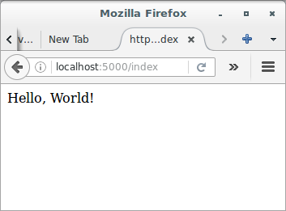

# Getting Started with Flask and Microblog

## Simple application structure

The application will exist in a *package*. In Python, a sub-directory 
that includes a *__init__.py* file is considered a package, and can be 
imported. When you import a package, the *__init__.py* executes and 
defines what symbols the package exposes to the outside world.

First, let's create a package called `app`, that will host the 
application. Make sure you are in the `microblog.git` directory and then 
run the following command:

```
(venv) $ mkdir app
```

The *__init__.py* for the `app` package is going to contain the 
following code:

```python
# app/__init__.py: Flask application instance
from flask import Flask

app = Flask(__name__)

from app import routes
```

The script above simply creates the application object as an instance of 
class `Flask` imported from the `flask` package. The `__name__` variable 
passed to the `Flask` class is a Python predefined variable, which is 
set to the name of the module in which it is used. Flask uses the 
location of the module passed here as a starting point when it needs to 
load associated resources such as template files. For all practical 
purposes, passing `__name__` is almost always going to configure Flask 
in the correct way. The application then imports the `routes` module, 
which doesn't exist yet.

One aspect that may seem confusing at first is that there are two 
entities named `app`. The `app` package is defined by the *app* 
directory and the *__init__.py* script, and is referenced in 
the `from app import routes` statement. The `app` variable is defined as 
an instance of class `Flask` in the *__init__.py* script, which makes it 
a member of the `app` package.

Another peculiarity is that the `routes` module is imported at the 
bottom and not at the top of the script as it is always done. The bottom 
import is a workaround to *circular imports*, a common problem with 
Flask applications. You are going to see that the `routes` module needs 
to import the `app` variable defined in this script, so putting one of 
the reciprocal imports at the bottom avoids the error that results from 
the mutual references between these two files.

So what goes in the `routes` module? The routes are the different URLs 
that the application implements. In Flask, handlers for the application 
routes are written as Python functions, called *view functions*. View 
functions are mapped to one or more route URLs so that Flask knows what 
logic to execute when a client requests a given URL.

The first view function, which you need to write in the new module 
named *app/routes.py*, is shown below:

```python
# app/routes.py: Home page route
from app import app


@app.route('/')
@app.route('/index')
def index():
    return "Hello, World!"
```

This view function is actually pretty simple, it just returns a greeting 
as a string. The two strange `@app.route` lines above the function 
are *decorators*, a unique feature of the Python language. A decorator 
modifies the function that follows it. A common pattern with decorators 
is to use them to register functions as callbacks for certain events. In 
this case, the `@app.route` decorator creates an association between the 
URL given as an argument and the function. In this example there are two 
decorators, which associate the URLs `/` and `/index` to this function. 
This means that when a web browser requests either of these two URLs, 
Flask is going to invoke this function and will pass the return value of 
it back to the browser as a response.

To complete the application, you need to have a Python script at the 
top-level that defines the Flask application instance. Let's call this 
script *microblog.py*, and define it as a single line that imports the 
application instance:

```python
# microblog.py: Main application module
from app import app
```

Remember the two `app` entities? Here you can see both together in the 
same sentence. The Flask application instance is called `app` and is a 
member of the `app` package. The `from app import app` statement imports 
the `app` variable that is a member of the `app` package.

Just to make sure things are done correctly, below you can see a diagram 
of the project structure so far:

```
microblog.git/
  venv/
  app/
    __init__.py
    routes.py
  microblog.py
```

Believe it or not, this first version of the application is now 
complete! Before running it, though, Flask needs to be told how to 
import it, by setting the `FLASK_APP` environment variable:

```
(venv) $ export FLASK_APP=microblog.py
```

Are you ready to be blown away? You can run your first web application, 
with the following command:

```
(venv) $ flask run
 * Serving Flask app "microblog"
 * Running on http://127.0.0.1:5000/ (Press CTRL+C to quit)
```

After the server initializes it will wait for client connections. The 
output from `flask run` indicates that the server is running on IP 
address 127.0.0.1, which is always the address of your own computer. 
This address is so common that is also has a simpler name that you may 
have seen before: *localhost*. Network servers listen for connections on 
a specific port number. Applications deployed on production web servers 
typically listen on port 443, or sometimes 80 if they do not implement 
encryption, but access to these ports require administration rights. 
Since this application is running in a development environment, Flask 
uses the freely available port 5000. Now open up your web browser and 
enter the following URL in the address field:

```
http://localhost:5000/
```

Alternatively you can use this other URL:

```
http://localhost:5000/index
```

Do you see the application route mappings in action? The first URL maps 
to `/`, while the second maps to `/index`. Both routes are associated 
with the only view function in the application, so they produce the same 
output, which is the string that the function returns. If you enter any 
other URL you will get an error, since only these two URLs are 
recognized by the application.



When you are done playing with the server, you can just press Ctrl-C to 
stop it.
